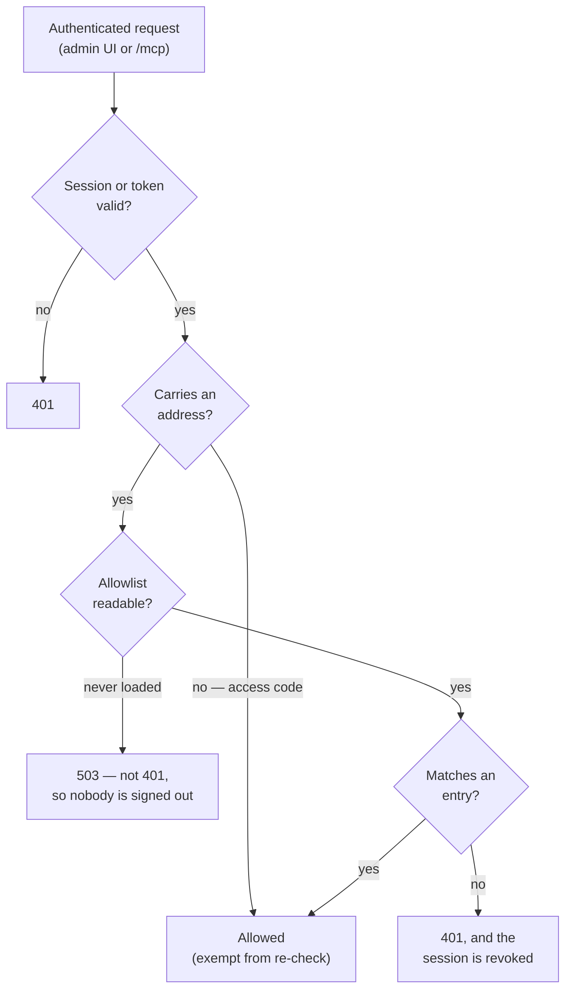

# Access model

Who may sign in to an orchestrator, and how that decision is made, stored, audited, and recovered.

This is the reference for `src/access-entries.ts`, `src/access-audit.ts`, `src/access-recovery.ts`, `src/oauth/authorize.ts`, and the authorization halves of `src/admin-session.ts` and `src/mcp.ts`. `CLAUDE.md` carries the summary and points here.

## The list

One row per entry in `access_entries`, keyed on `(kind, value)`:

| Column | Meaning |
|--------|---------|
| `kind` | `domain` (a whole email domain) or `address` (one person) |
| `value` | The domain or address, lowercased and trimmed on write |
| `role` | `user` or `admin` |
| `provider` / `subject` | The OIDC identity this entry bound to on first sign-in; null until then |
| `added_at` / `added_by` | When it was written, and the address of whoever wrote it |

Two rules are enforced at write time rather than left to the caller:

- **A domain admits as `user`. Only a listed address may be `admin`.** A domain entry saved with `admin` is refused. This is what makes "grandfather the existing identities as admin" a coherent instruction — a domain admits an unbounded set with nobody to enumerate.
- **The list is capped at 200 entries**, because it is scanned on every authenticated request.

## Where the list comes from

`OAUTH_ALLOWED_DOMAINS` and `OAUTH_ALLOWED_EMAILS` **seed** the allowlist. They apply while nothing is stored, and the **first save at `/admin#access` hands authority to the database permanently** — from then on the environment values are displayed on that page as stale, and never consulted.

The handover is deliberately operator-driven, never a boot-time migration. Two consequences worth knowing:

- An existing deployment that never opens the Access page behaves exactly as it did before the page existed.
- If the stored list is emptied, the environment values apply again — a lost volume degrades to the seed rather than locking everyone out.

## How a request is decided



Matching runs in precedence order, and stops at the first hit:

| Order | Entry | Matches when |
|-------|-------|--------------|
| 1 | Address, bound | `provider` **and** `subject` both equal the identity's |
| 2 | Address, unbound | The entry's value equals the verified email |
| 3 | Domain | The email's domain equals the entry's value |

An address entry outranks a domain entry: it is the more specific grant, and the only one that can carry a role. A malformed identifier with no `@` has a domain equal to itself, and is excluded from rule 3 so it cannot match a domain entry.

## Binding

An entry is **declared** by address and **matched** by provider identity once bound. The first successful sign-in against an unbound address records the provider and the OIDC `sub`; from then on that entry matches on those two alone.

- A **rename** keeps its role — the `sub` is stable across an address change.
- A **reassigned address inherits nothing** — a new person holding an old address presents a different `sub` and does not match.
- **Binding happens once.** A later sign-in cannot re-point an entry at another subject.
- Known cost: the same person arriving via a second provider presents a different `sub` and will not match their bound entry. They need a fresh entry.

Domain entries never bind, because they admit many identities.

## Re-checking, and freshness

Every authenticated request re-checks the identity against the list in force — the admin gate in `src/admin-session.ts` and the `/mcp` gate in `src/mcp.ts` share one matcher. A removal therefore ends a session on the requester's **next request**, rather than at token expiry, which for `/mcp` would otherwise be up to an hour.

The list is held in memory, so the re-check costs no query. It is re-read in two situations:

- **Immediately, on any write this process makes** — a save or a first-sign-in binding. Revocation through the admin UI is never delayed.
- **Once per poll interval otherwise**, bounded by `POLL_INTERVAL_MS`. This covers writes made by *another process* — in practice the recovery command — which cannot invalidate this process's cache.

That second case is why recovery needs no restart. It also means a hand-edit of the database converges within a poll instead of never.

## Failure behaviour

Authorization is **fail-closed**, and the two failure modes are deliberately different:

- **A read fails while a good list is cached** — the cached list keeps serving, and a warning is logged at most once per window rather than on every request. Nobody is ejected by a transient database fault.
- **A read fails with nothing ever cached** — the admin UI and `/mcp` deny, while polling and dispatch continue unaffected. The next request retries.

A denial caused by an unreadable list answers **503, never 401**. The distinction is load-bearing: the admin SPA treats 401 as "your session ended" and logs the user out, so returning 401 here would sign out every operator over a database hiccup.

## The audit trail

Every change to the list writes a row to `access_audit`: when, who, which action (`save` or `recover`), and a before/after snapshot of the list. Snapshots are narrowed to `{kind, value, role}` at write time, so no caller can widen what gets stored.

The trail has **no retention policy, deliberately** — it grows only when a human changes who can sign in, and pruning is the anti-goal for an audit record. It is scoped to access changes only; the general facility across every mutating admin route is separate, unbuilt work.

The Access page renders the recent entries, summarising each as added / removed / role changed with counts.

## Guards on a save

- **Self-lockout** — a save whose resulting list would not admit its own author is refused. The check runs *inside* the transaction and against the real post-write result, so it cannot be fooled by predicting the outcome, and a refusal rolls back the whole save including its audit row.
- **A signed-in identity is required.** `POST /api/access` answers 403 to a session with no address, because the change could not be attributed to anyone.

## Recovery from lockout

When nobody can sign in, recovery is a **command run on the host**, not a credential:

```bash
fly ssh console -a <app>
node dist/access-recovery.js --email you@example.com          # add, keeping the existing list
node dist/access-recovery.js --email you@example.com --only   # replace the list entirely
```

There is no standing credential to steal: the authority is shell access, which already implies reading the database and every secret. The change is audited with a **null actor**, since nobody authenticated for it, and announced on the notification webhook if one is configured — a failed notification does not fail the recovery.

Adding an address already on the list **promotes** it rather than failing as a duplicate, which matters because a mangled role is one of the ways to get locked out. The change takes effect within one poll interval; no restart is needed.

## Access-code sessions

The deprecated `ADMIN_ACCESS_CODE` path remains for local development. Such a session carries no address, so it is **exempt from the re-check** — there is nothing to match — and it is **read-only on the Access page**, enforced server-side rather than only hidden in the UI.

It holds no architectural responsibility, which is what keeps the deprecated path deletable.

## Not yet built

`role` is stored and displayed but **not enforced anywhere** — every authenticated identity still has full administrative access. Admin/User enforcement, per-page grants, and the guard against removing the last admin are separate work.
