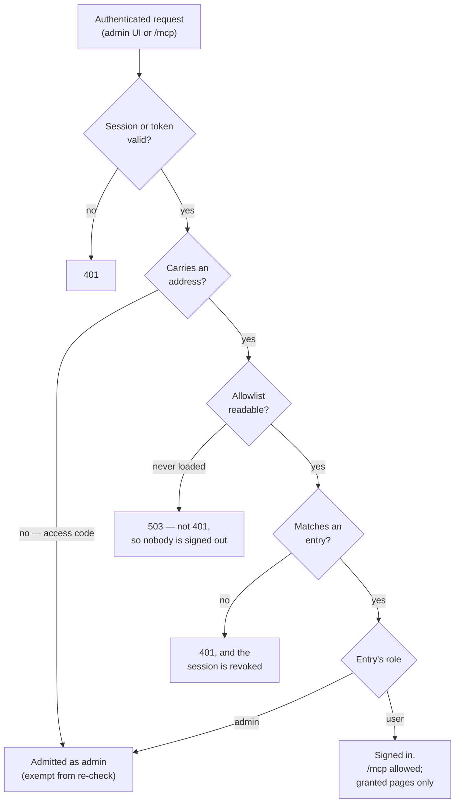

# Access model

Who may sign in to an orchestrator, and how that decision is made, stored, audited, and recovered.

This is the reference for `src/access-entries.ts`, `src/access-page-grants.ts`, `src/access-audit.ts`, `src/access-recovery.ts`, `src/oauth/authorize.ts`, and the authorization halves of `src/admin-session.ts` and `src/mcp.ts`. `CLAUDE.md` carries the summary and points here.

## The list

One row per entry in `access_entries`, keyed on `(kind, value)`:

| Column | Meaning |
|--------|---------|
| `kind` | `domain` (a whole email domain) or `address` (one person) |
| `value` | The domain or address, lowercased and trimmed on write |
| `role` | `user` or `admin` |
| `provider` / `subject` | The OIDC identity this entry bound to on first sign-in; null until then |
| `added_at` / `added_by` | When it was written, and the address of whoever wrote it |

Two rules are enforced at write time rather than left to the caller:

- **A domain admits as `user`. Only a listed address may be `admin`.** A domain entry saved with `admin` is refused. This is what makes "grandfather the existing identities as admin" a coherent instruction — a domain admits an unbounded set with nobody to enumerate.
- **The list is capped at 200 entries**, because it is scanned on every authenticated request.

## Where the list comes from

`OAUTH_ALLOWED_DOMAINS` and `OAUTH_ALLOWED_EMAILS` **seed** the allowlist. They apply while nothing is stored, and the **first save at `/admin#access` hands authority to the database permanently** — from then on the environment values are displayed on that page as stale, and never consulted.

The handover is deliberately operator-driven, never a boot-time migration. Two consequences worth knowing:

- An existing deployment that never opens the Access page behaves exactly as it did before the page existed.
- The fallback is a safety net, not a revert. An empty stored table means the environment values apply again, so a lost volume degrades to the seed rather than locking everyone out. Emptying the list deliberately is refused: the self-lockout guard sees a stored list that no longer admits its author.

## How a request is decided



Matching runs in precedence order, and stops at the first hit:

| Order | Entry | Matches when |
|-------|-------|--------------|
| 1 | Address, bound | `provider` **and** `subject` both equal the identity's |
| 2 | Address, unbound | The entry's value equals the verified email |
| 3 | Domain | The email's domain equals the entry's value |

An address entry outranks a domain entry: it is the more specific grant, and the only one that can carry `admin`. A malformed identifier with no `@` has a domain equal to itself, and is excluded from rule 3 so it cannot match a domain entry.

## Roles

`admin` may use every admin route. `user` may sign in and reach `/mcp`, plus the read paths of whichever admin pages have been granted; every other `/api/` route answers 403, except the identity probe the SPA needs in order to know it is signed in. Nothing is granted until someone grants it, so a new deployment starts with `user` meaning `/mcp` and nothing else. See [Page grants](#page-grants).

**A domain never confers `admin`, at any point — including while the environment seed is in force.** A domain grant asserts only that someone shares a domain with an operator, which an identity provider will issue to anyone it admits there: contractors, service accounts, a departed employee whose account still resolves. Granting administration on that basis turns authorization from a decision about a person into an attribute check, and the audit trail then records who acted while nobody ever decided that person could act. Adding one address is the entire cost of avoiding that.

An access-code session has no entry to take a role from and is treated as `admin`, because the code is a shared secret whose holder already has full access. It is still refused on the Access page, since a change to who gets in must be attributable to someone.

### A seed with no admin

A deployment configured with `OAUTH_ALLOWED_DOMAINS` alone admits everyone as `user`, so signing in succeeds and the whole admin UI answers 403. That is a **misconfiguration, not a lockout** — the recovery command is not involved, and the fix is to set `OAUTH_ALLOWED_EMAILS` and restart.

It is surfaced three ways, because the symptom otherwise looks like a broken UI rather than a setting: a `[main]` warning at boot, a banner on the sign-in page, and this document. A stored list cannot reach that state at all — the last-admin guard refuses a save that would leave it without one.

## Page grants

What a `user` may open beyond `/mcp`. Stored one row per page in `access_page_grants`, edited from the **User page access** control on `/admin#access`, and **empty until someone grants something**.

**Grants are global, not per-person.** One set applies to every `user` on the orchestrator. Per-user grants are unbuilt; the table is keyed on the page alone.

**Grantability is a property of the page, and lives only on the server.** `PAGE_ROUTES` in `src/access-page-grants.ts` maps each grantable page to the exact API paths it may read, and is the single definition of what can be granted — a page is grantable *because* someone declared what it reads. Two consequences follow without anyone maintaining a second list: a page added to the sidebar is ungrantable until it appears there, and an endpoint added later is Admin-only until it is listed.

Currently grantable: Issues, Pipelines, Pull requests, Blockers, Reports, Pipelines & steps, Sessions, Reaper, Audit log, Customizations. Read the constant rather than this sentence when it matters.

**A grant admits exact paths by `GET`, and nothing else.** Prefix matching is deliberately unsupported, because a prefix would also grant sub-paths added under it later — the opposite of failing closed. The useful consequence is that every mutating route stays Admin-only for free: `DELETE /api/dedup/{id}` is refused for a user holding the Audit grant, without anyone having to enumerate it.

### What grants do not restrict

**Page grants govern the admin UI. They do not govern what a user can read.** `/mcp` is role-blind by design — a `user` granted nothing still reaches every MCP tool, including the project inventory, fleet report, tenant health, runner mode, and in-flight jobs. "Granted nothing" therefore means "no admin pages", never "sees nothing", and an operator deciding what to grant should treat MCP as the floor rather than the ceiling.

This does not defeat the credential rule below: MCP's project listing selects its fields explicitly and omits `extraEnv`, so the runner environment values never leave through it.

### Credential-bearing pages

A page whose data includes credentials or infrastructure control is never grantable, and the grant editor **shows it greyed with the reason** rather than hiding it — so a client can see what exists and ask, rather than assume the page is missing.

The test for a page in this position: if it makes no sense without the sensitive data, it is permanently ineligible; if the sensitive part can be trimmed without harming what the page is for, converting it becomes a decision someone can make. Overview is the live example — it is excluded only because the project-mapping payload it reads carries `extraEnv`.

### Admin-only elements inside a granted page

Some controls sit on a page a `user` may open. They are withheld in the SPA by a `window.isAdmin()` check at each call site: the Audit page's dedup **Delete**, the Sessions page's **Destroy**, and the Pipelines row click that opens the job drawer.

These markers are **cosmetic only**. Each control calls a route that exact-path `GET` matching already refuses, so a marker someone forgets to add yields a 403, never a leak. The Pipelines drawer is the reason its row click is withheld rather than its endpoint granted: the drawer reads `/api/mappings`, which is the same `extraEnv`-carrying payload that makes Overview ineligible.

### Grants are not audited

`access_audit` covers the allowlist only. A grant change writes `granted_by` and `granted_at` on the row, but nothing reads them yet and the Access page's change log will never show a grant — even though both controls sit on that page. The provenance is stored in advance of the general audit facility, which is separate, unbuilt work.

### In the SPA

Three behaviors are worth knowing before reading `src/admin-ui/`:

- **The router does not route until the session identity has resolved.** A page's init runs exactly once, so a page rendered against an unknown role would keep that render for the life of the tab. `auth.js` calls `startRouting()` once the identity is known, and the router ignores every hashchange before that.
- **Ungranted nav items are hidden, not removed**, and the router treats a hidden item as unreachable — so typing the hash gains nothing over clicking. A `user` granted nothing lands on a page explaining that state rather than a blank panel.
- **The sidebar is computed once, at sign-in.** A grant changed mid-session does not appear until the user reloads. The server enforces the new set immediately either way, so the stale nav can only under-offer, never over-permit.

## Binding

An entry is **declared** by address and **matched** by provider identity once bound. The first successful sign-in against an unbound address records the provider and the OIDC `sub`; from then on that entry matches on those two alone.

- A **rename** keeps its role — the `sub` is stable across an address change.
- A **reassigned address inherits nothing** — a new person holding an old address presents a different `sub` and does not match.
- **Binding happens once.** A later sign-in cannot re-point an entry at another subject.
- Known cost: the same person arriving via a second provider presents a different `sub` and will not match their bound entry. They need a fresh entry.

Domain entries never bind, because they admit many identities.

### Re-pointing a bound entry

When an address changes hands — someone leaves and their address is reassigned — the entry stays bound to the departed person's subject and the new holder matches nothing. They fall through to domain admission as `user`, or are denied outright.

**One save cannot fix it.** A save updates the role of a surviving entry and leaves its binding alone, by design, since that is what lets a rename keep its role. The fix is two saves:

1. Remove the entry, and save. The row is deleted, binding and all.
2. Add the address back, and save. It is inserted fresh and unbound, and binds again on the new holder's first sign-in.

This is easy to miss because nothing on the page shows it: `provider` and `subject` are stored and never rendered, so the address reads as `admin` while the person holding it is not one. Check the audit trail or the row itself if a newly-admitted person is being refused a role the list appears to give them.

## Re-checking, and freshness

Every authenticated request re-checks the identity against the list in force — the admin gate in `src/admin-session.ts` and the `/mcp` gate in `src/mcp.ts` share one matcher. A removal therefore ends a session on the requester's **next request**, rather than at token expiry, which for `/mcp` would otherwise be up to an hour.

The list is held in memory, so the re-check costs no query. It is re-read in two situations:

- **Immediately, on any write this process makes** — a save or a first-sign-in binding. Revocation through the admin UI is never delayed.
- **Once per poll interval otherwise**, bounded by `POLL_INTERVAL_MS`. This covers writes made by *another process* — in practice the recovery command — which cannot invalidate this process's cache.

That second case is why recovery needs no restart. It also means a hand-edit of the database converges within a poll instead of never.

**Grants are not cached, and deliberately so.** They are read from the table on each request that needs them, which is only ever a non-admin's — the admin check short-circuits before the read. A grant therefore takes effect on the next request with no window at all, and the query is confined to the sessions that a cache would have been protecting.

## Failure behavior

Authorization is **fail-closed**, and the two failure modes are deliberately different:

- **A read fails while a good list is cached** — the cached list keeps serving, and a warning is logged at most once per window rather than on every request. Nobody is ejected by a transient database fault.
- **A read fails with nothing ever cached** — the admin UI and `/mcp` deny, while polling and dispatch continue unaffected. The next request retries.

A denial caused by an unreadable list answers **503, never 401**. The distinction is load-bearing: the admin SPA treats 401 as "your session ended" and logs the user out, so returning 401 here would sign out every operator over a database hiccup.

## The audit trail

Every change to the list writes a row to `access_audit`: when, who, which action (`save` or `recover`), and a before/after snapshot of the list. Snapshots are narrowed to `{kind, value, role}` at write time, so no caller can widen what gets stored.

The trail has **no retention policy, deliberately** — it grows only when a human changes who can sign in, and pruning is the anti-goal for an audit record. It is scoped to access changes only; the general facility across every mutating admin route is separate, unbuilt work.

The Access page renders the recent entries, summarizing each as added / removed / role changed with counts.

## Guards on a save

- **Self-lockout** — a save whose resulting list would not admit its own author is refused.
- **Last admin** — a save whose resulting list has entries but no `admin` address is refused, so a stored list can never become unadministrable. An *empty* result is allowed by this guard, since that hands authority back to the environment rather than leaving nobody in charge — but no request can produce one: the route requires a signed-in identity, and the self-lockout guard then refuses a list that would not admit them. Emptying the table is a database operation, not an admin-UI one, which is what makes the handover in **Where the list comes from** permanent rather than merely sticky.
- **A signed-in identity is required.** `POST /api/access` answers 403 to a session with no address, because the change could not be attributed to anyone.

Self-lockout and last-admin both run *inside* the transaction and against the real post-write result, so neither can be fooled by predicting the outcome, and a refusal rolls the whole save back including its audit row. The shape rules above — a domain cannot be `admin`, and the 200-entry cap — are checked earlier, before the transaction opens.

## Recovery from lockout

When nobody can sign in, recovery is a **command run on the host**, not a credential:

```bash
fly ssh console -a <app>
node dist/access-recovery.js --email you@example.com          # add, keeping the existing list
node dist/access-recovery.js --email you@example.com --only   # replace the list entirely
```

There is no standing credential to steal: the authority is shell access, which already implies reading the database and every secret. The change is audited with a **null actor**, since nobody authenticated for it, and announced on the notification webhook if one is configured — a failed notification does not fail the recovery.

Adding an address already on the list **promotes** it rather than failing as a duplicate, which matters because a mangled role is one of the ways to get locked out. The change takes effect within one poll interval; no restart is needed.

## Access-code sessions

The deprecated `ADMIN_ACCESS_CODE` path remains for local development. Such a session carries no address, so it is **exempt from the re-check** — there is nothing to match — is treated as `admin`, and is **read-only on the Access page**, enforced server-side rather than only hidden in the UI.

It holds no architectural responsibility, which is what keeps the deprecated path deletable.

## Not yet built

**A general audit trail.** `access_audit` covers the sign-in allowlist and nothing else. Every other mutating admin route — runner mode, mappings, secrets, deploy policy, dedup clearing, and page grants themselves — changes behavior with no record of who did it. The Audit log page's subtitle promises this and currently shows the dispatch dedup ledger.

**Per-person grants.** The grant set is global: every `user` on an orchestrator sees the same pages. The table is keyed on the page alone, so distinguishing two users means a schema change, not a setting.

**Re-pointing a bound entry in one step.** Today it takes a remove-then-add pair of saves, and binding state is never shown on the page. Surfacing which entries are bound, and letting a save clear a binding explicitly, are both open.
