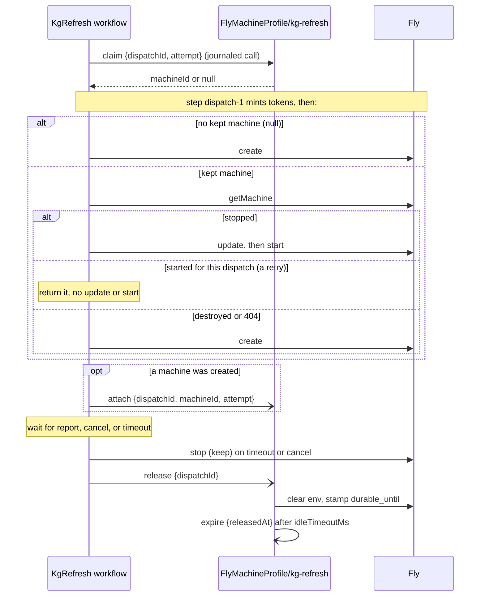

# Fly machine lifecycle

How a pipeline's Fly machine is created, reused, stopped, and destroyed. Today only `kg-refresh` keeps a machine (AII-1106); every other Fly run (`purpose: session`) is one-shot: created per run and destroyed by the stop path or the reaper. Decision record: [ADR 037](adr/037-a-durable-runner-is-a-profile-object-that-owns-one-kept-machine.md).

## Why a kept machine

`create` pulls the runner image every time (5 to 39 s measured on 2026-10-06 and 2026-10-07). `update` then `start` on a stopped machine gives a clean disk, the new env, the new size, and the current image in about 2.5 s (`update` about 0.5 s, `start` about 2 s). Fly facts the design relies on: `update` takes the whole config; `update` on a stopped machine applies it and does not start it; `update` on a running machine reboots it; `update` resets the machine's event history.

## Who owns what

| Owner | Responsibility | Code |
|---|---|---|
| `FlyMachineProfile/<pipeline>` object | Identity of the one kept machine, who holds it, the idle timer, the scrub on release, the destroy on expiry. Never sees the run's env. | `src/restate/fly-machine-profile.ts` |
| `KgRefresh` workflow | `claim` before dispatch, `attach` after a create, `release` at the end, stop (not destroy) on timeout and cancel. | `src/restate/kg-refresh-workflow.ts` |
| The workflow's `dispatch-<attempt>` step | The Fly writes that need the run's tokens: `create`, or `update` then `start`. Tokens are minted and consumed inside this step and never reach a handler input or the journal. | `launchKeptMachine` in `src/restate/kg-refresh-production.ts`, called from the Fly sender in `src/restate/kg-refresh-senders.ts` |
| Reaper | Backstop only: skips `durable-runner` machines, destroys one past its `durable_until` (rule `durable-expired`). | `src/reaper.ts` |

The Fly write stays in the workflow's step, not in the object, because a handler input is journaled (ADR 037 section 2).

## Machine metadata

`buildSessionMachineConfig` stamps `purpose`, defaulting to `session`. A kept machine also carries `pipeline` and `dispatch_id`; the keys are constants in `src/restate/fly-machine-profile.ts`.

| Key | Value | Set by |
|---|---|---|
| `purpose` | `session` (default) or `durable-runner` | the dispatch step |
| `pipeline` | `kg-refresh` | the dispatch step, only for a durable runner |
| `dispatch_id` | the workflow's dispatch id | the dispatch step, only for a durable runner |
| `durable_until` | epoch seconds: release time + idle timeout + 1 day | the object's `release` scrub |

## A run's life

### The dispatch step's decision table

| `claim.machineId` | `getMachine` answer | Action |
|---|---|---|
| null | not called | `createMachine`; `attach` after the step |
| set | `stopped` (or any state but the ones below) | `updateMachine` then `startMachine` |
| set | `started`, same `dispatch_id` | already dispatched (a retry); return the machine, no `update` (it would reboot a started machine) |
| set | `started`, other `dispatch_id` | throw (the hold is wrong); the step retries, then the run ends `dispatch_rejected` |
| set | `destroyed` or 404 | `createMachine`; `attach` carries `replaces: <old id>` and replaces the object's machine id |
| set | lookup error | throw; the step retries |

The `attach` for a replacement carries `replaces` (the destroyed machine's id), so the object accepts it at attempt 1; without it the attempt rule would refuse the swap and the new machine would run unrecorded and unreleased.

`updateMachine` makes Fly replace the instance, so the dispatch does not `start` straight after it. It waits (Fly's `/wait?instance_id=<the update's instance_id>&state=stopped`, bounded at 60 s) for the replaced instance to reach `stopped`, then starts. Before the `update`, a machine still `replacing`, `starting` or `stopping` is polled until it is `stopped` or `started`. A 409 `concurrent update in progress` / `machine is replacing` on `update`, or a 412 `machine getting replaced` on `start`, waits the same way and repeats that call once inside the attempt; a window that outlasts the bound throws and the step retries. Fly event evidence, 2026-10-09 21:05Z: `update`/`replacing` 21:05:24.07Z, replaced instance `stopped` 21:05:25.21Z, `start` refused 412, the retry's `update` 21:05:25.38Z, 409. An `update` also resets the machine's event history, so the events do not name earlier updates.

The step keeps `maxRetryAttempts: 3`, with a 3 s initial delay that doubles (`DISPATCH_RETRY_INITIAL_INTERVAL`), so retries can outlast a replace window. The reconcile read makes a retry after a lost ack safe. A lost ack after a `create` that had no kept machine to reconcile against creates a second machine; the first is left with no `durable_until` until the object records one (see Gaps).

The log line is `[kg-refresh] dispatched via Fly (reused machine <id>)` or `(created machine <id>)`, followed by `(waited <n> s for the replace)` when the launch waited at least a second; `get_session_machine` shows the metadata.

### Step names carry the attempt

The dispatch step is journaled as `dispatch-<attempt>`; the `step` state value stays `dispatch` (a stage name read by `kgStageForStep`). `attempt` is the constant 1 until the resume path of AII-1032 raises it, so a second attempt journals a new step instead of replaying the first attempt's result. The token rows are keyed by `(dispatch_id, audience)`, so a second attempt also needs its mint keyed by attempt; that is AII-1032's.

## Stop, release, expire

- **Timeout and cancel stop the kept machine; they do not destroy it.** `stopBackendRun(config, mode, id, { keep: true })` calls `stopMachine`. The workflow passes `keep` for a Fly run whose result carries a kept `machineId`. A GitHub Actions run, a local container, and every caller that passes no option (`confirmAdmissionTerminated`, `planning-run-production.ts`) keep the destroy path.
- **Release** runs in `finish` and in the `finally` of the outer catch, beside `KgRepo.release`. A duplicate send is a no-op in the object. It scrubs the machine with one `update` (`clearMachineEnv`) that clears the env and writes `durable_until` together, because a separate metadata write after the update is overwritten by it (Fly applies the update after the API answers, with the older metadata snapshot). It clears the hold, and schedules `expire` after the profile's `idleTimeoutMs` (default 7 days). If the scrub fails across its retry policy (five attempts, waits of 2, 4, 8 and 10 s) the machine is destroyed instead.

  The scrub waits for the machine to settle and verifies the result before it reports failure (AII-1190). `clearMachineEnv` polls until the machine is out of `replacing`, sends the update, waits again, and reads the machine back; it succeeds only when `config.env` is empty and the requested `durable_until` is present. A 409 `concurrent update in progress` and a 429 from Fly are waits, not failures: the 409 means an update is applying, the 429 waits the `retry-after` interval (else 2 s), and both re-read the machine instead of throwing. Only an env that is still set after the verified read, or a `replacing` state that outlasts the 60 s settle timeout, fails the attempt.

  **Per-call bound.** The 429 sleep is capped at 30 s whatever `retry-after` says, and both Fly replace-window 409 messages (`concurrent update in progress`, `machine is replacing`) count as waits. One `clearMachineEnv` call therefore takes at most 3 passes x (60 s settle + 30 s 429 sleep + 60 s settle) = 450 s plus HTTP time. The `FlyMachineProfile` object sets `inactivityTimeout` to 10 minutes and `abortTimeout` to 15 minutes (the same option pair as `KgRefresh`), so a slow scrub call is not aborted by the server's 1-minute defaults. The bound is per call; the five-attempt `SCRUB_RETRY` is unchanged. The timeouts apply to every handler on the object.
- **Expire** destroys the machine only if it was released at exactly `releasedAt` and nobody holds it since. A newer `claim` and `release` moves `lastUsedAt`, so the older timer does nothing.
- **Reaper backstop (`durable-expired`).** The reaper skips every `purpose: durable-runner` machine, bypassing the dispatch_log rules, and destroys one only when `durable_until` is in the past. A missing `durable_until` keeps the machine; a corrupt one counts as expired. This covers an owner lost with the Restate store.

- **Every destroy outside the object is recorded and refuses a `durable-runner` machine (AII-1144).** The legacy monitor (`monitor-stopped`, `monitor-timeout`), the stuck-watchdog stop (`ttl-stop`), the admin stop endpoints (`admin-stop`), the planning cleanup (`planning-end`) and `stopBackendRun` (`backend-stop`) all call `destroyMachineRecorded` (`src/backend-run.ts`). It logs `[fly] destroying machine <id> reason=<reason>`, records a `reaper_actions` row `destroy:<reason>`, then destroys. For a `purpose: durable-runner` machine it instead stops it if started, logs `[fly] kept machine <id> owned by FlyMachineProfile; stop instead of destroy`, and records `durable-skip:<reason>`. To find who destroyed a machine, open `/admin#reaper` (or `GET /api/reaper/recent`) and read the `ruleMatched` of the row for its id. Boot reconciliation (`startupReconciliation`) skips durable-runner machines too, recording `durable-skip:startup-reconcile`, rather than destroying them as orphans or stale-terminal. Only the object (`expire`, `destroy-unscrubbed`) and the reaper (`durable-expired`) call `destroyMachine` directly.

## Rollback

Revert the change. A kept machine left behind is destroyed by the reaper once its `durable_until` passes, or by hand with `fly machines destroy`.

## Gaps

- A step retry after a lost ack of the first `create` (no kept machine yet) creates a second machine, because there is no recorded id to reconcile against. The orphan is a `durable-runner` with no `durable_until`, so the reaper does not remove it; destroy it by hand.
- The resume path (attempt above 1) is AII-1032's; only attempt 1 is sent today.
