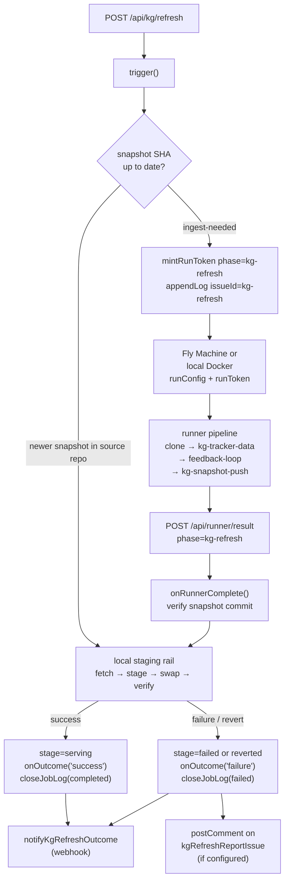

# Issueless run kinds

How to pipeline a run kind that dispatches a runner without a tracker issue or a pull request — the job-store row is the only tracking record, and all credentials and data flow exclusively through authenticated callbacks.

The `kg-refresh` rail (AII-493–521) is the sole concrete implementation; this document uses it as the reference throughout. A future scheduled-refresh or maintenance run kind should extend the checklist in §10 rather than write a separate reference.

---

## 1. Mental model

A normal implementation run is anchored to a tracker issue: the dispatch creates a dedup entry keyed on the issue's UUID, the runner token encodes that UUID, and every callback writes to the issue (labels, comments, Done state). The issue is both the tracking record and the authority on lifecycle.

An issueless run kind has no tracker issue. The `dispatch_log` row **is** the tracking record. It carries:

- a stable synthetic `issue_id` string (e.g. `"kg-refresh"`) in place of a UUID
- `issue_identifier = null`, `issue_title = null`, `team_key = null`, `repo = null`
- a `phase` tag that identifies the run kind across the whole observability surface

Nothing in the dispatch or callback path touches the ticketing provider. The lifecycle is driven by the in-process state machine inside the orchestrator (`KgRefreshHandle`, `makeKgRefresh()` in `src/kg-refresh.ts`), backed by the settings table for crash recovery.

---

## 2. Flow diagram



---

## 3. Envelope and dispatch

The orchestrator builds a `RunConfigV1` (defined in `src/run-config.ts`) with the following fields for a kg-refresh run:

```typescript
const runConfig: RunConfigV1 = {
  v: 1,
  issue: { id: "kg-refresh", identifier: "KG-REFRESH", title: "KG ingest", description: "" },
  runnerPhase: "kg-refresh",
  kgSourceRepo: "<owner/repo>",     // from config.kgSourceRepo
  runnerCallbackUrl: "<url>",        // RUNNER_CALLBACK_BASE_URL + "/api/runner/result"
};
```

What is **absent** vs a normal implementation run:
- No `prNumber`, `baseBranch`, `branchPrefix`
- No `profiles`, `planningContext`, `groupingParent`, `dependencyTokenScope`
- No publication token (there is no target repo to push a PR to)

The envelope travels as the `AI_IMPLEMENT_RUN_CONFIG` environment variable on both Fly Machines and local Docker. The dispatch path is `dispatchKgRefreshRun()` in `src/index.ts` (~line 3019), which is wired into `makeKgRefresh()` as `input.dispatchRun`.

**Callback-config guard (422):** The guard at `src/kg-refresh.ts:547` fires *synchronously* inside `trigger()` before any dispatch attempt. If `input.dispatchRun` is defined but `RUNNER_CALLBACK_BASE_URL` or `RUNNER_TOKEN_SECRET` is missing, it returns HTTP 422 (`callback-unconfigured`) immediately — dispatching without a callback URL would stall the refresh with no way to report completion.

**Execution backend selection** (evaluated inside `dispatchKgRefreshRun()`):

`dispatchKgRefreshRun()` calls `resolveExecutionPath(getRunnerMode().mode, "github-actions")` to determine the backend. The `"github-actions"` second argument is the kg-refresh-specific default: on a GHA-primary orchestrator running with `runnerMode = "default"`, this produces `"github-actions"`. The selector honours the global runner mode override before choosing a path:

| Global runner mode | Resolved path |
|---|---|
| `default` | `github-actions` (kg-refresh default) |
| `gha` | `github-actions` |
| `fly` | `fly-machines` (requires `FLY_SESSIONS_TOKEN` + `FLY_SESSIONS_APP`) |
| `local` | `local-docker` (requires `LOCAL_RUNNER_IMAGE`) |
| `shadow` | collapses to `github-actions` — two concurrent ingest runs would race to push the same snapshot commit |

**GitHub Actions backend:** dispatches `workflow_dispatch` to `claude-kg-refresh.yml` in the KG source repo (`KG_SOURCE_REPO`) with inputs `run_config` and `run_token`. If the workflow file is absent, the dispatch returns HTTP 422; `dispatchKgRefreshRun()` throws with a message naming the missing file and the sync instruction. After a successful dispatch, `findWorkflowRunId()` is attempted (30-second look-back, best-effort) and the resulting run ID is stored on the `dispatch_log` row via `updateJobRunId()`. The `dispatch_log` row has no `machine_nonce` for GHA-backed runs.

**Fly Machines backend:** unchanged from the original implementation. Creates a session machine with `phase: "kg-refresh"`. Returns `machineId + machineNonce`.

**Local Docker backend:** starts a local container via `startLocalRunnerContainer()`. Returns `machineNonce` only.

If the resolved path requires a backend that is not configured (e.g. `fly-machines` but no sessions app), `dispatchKgRefreshRun()` throws immediately. The throw is caught by the async IIFE catch block in `trigger()`, which sets `stage = "failed"` and fires `onOutcome("failure", ...)`.

The `claude-kg-refresh.yml` workflow lives in `workflows/` and must be added to the KG source repo before GHA dispatch can succeed. Unlike `claude-implement.yml`, it is not automatically synced — it is a one-time manual step per KG source repo.

---

## 4. Jobs-store row

The `dispatch_log` row (schema in `src/log.ts`, `initLogTable`) written by `appendLog()`:

| Column | Value | Notes |
|--------|-------|-------|
| `issue_id` | `"kg-refresh"` | Synthetic string constant, not a UUID |
| `issue_identifier` | `null` | No tracker issue |
| `issue_title` | `null` | |
| `team_key` | `null` | No ticketing mapping |
| `repo` | KG source repo (`owner/repo`) | Populated from `KG_SOURCE_REPO`; required by `handleDestroySession` to cancel a GHA-backed run |
| `phase` | `"kg-refresh"` | Run-kind tag, drives observability and routing |
| `execution_mode` | `"fly-machines"`, `"local-docker"`, or `"github-actions"` | Resolved from global runner mode at dispatch time |
| `machine_id` | Fly machine ID | null for GHA and local Docker |
| `machine_nonce` | Generated for Fly/local | null for GHA; `updateJobStatus` clears it on terminal outcome |
| `run_id` | GHA workflow run ID | Set via `updateJobRunId()` when `findWorkflowRunId` succeeds; null for Fly/local |
| `pr_url` | Fly machine URL or GHA run URL | Stored via `updateJobPrUrl(jobId, logsUrl)` on dispatch; used as the logs link |

The row lifecycle:
1. Inserted with `status = "dispatched"` when the runner is launched
2. For GHA: updated to `status = "running"` immediately when a `run_id` is found by `findWorkflowRunId()`; for Fly/local, updated to `status = "running"` when a progress callback arrives (if configured)
3. Closed to `"completed"`, `"failed"`, or `"timed_out"` by `closeJobLog()` on every terminal outcome

`machine_nonce` being cleared on terminal outcome is load-bearing: the row-eviction logic in `appendLog()` only prunes rows where `machine_nonce IS NULL`, so an in-flight row is never evicted while the runner holds its nonce.

---

## 5. Credentials and data

### Runner token

Minted by `mintRunToken()` (`src/runner-tokens.ts`) at dispatch time:

```typescript
mintRunToken({
  issueId: "kg-refresh",
  mappingTeamKey: "",      // empty — no ticketing mapping bound
  phase: "kg-refresh",
  audience: "result",
  ttlSeconds: 4 * 60 * 60, // matches KG_REFRESH_TTL_MS
  secret: runnerTokenSecret,
})
```

This token is passed as `runToken` into `buildSessionMachineConfig()`, which places it in the machine environment as `RUN_TOKEN`. No progress token is minted; `RUN_PROGRESS_TOKEN` is **not** set in the runner environment.

A second (`publication`) token is **not** minted: there is no target repository, so the runner never calls `POST /api/runner/publication-token`.

> **Current degraded state:** Both vending endpoints below require a bearer token with `audience = "progress"`. Because the kg-refresh dispatch mints only a result token, the runner cannot satisfy those checks. Both endpoints silently fail/skip rather than hard-error — see each section for the exact degradation mode.

### KG push token

The runner calls `GET /api/runner/kg-push-token` to receive a `contents: write` GitHub App token scoped to the KG source repository. The endpoint is implemented in `src/kg-push-token-vending.ts`:

- Verifies the bearer token with `audience = "progress"` (multi-use, non-consuming, so the git credential helper can re-mint on expiry)
- Phase-gates: only `phase === "kg-refresh"` tokens are accepted
- Returns a token scoped exclusively to `owner/repo` of `KG_SOURCE_REPO`

**Degraded state:** the kg-refresh runner only holds a result token. When it presents that token, `verifyRunToken(..., "progress", ...)` returns `verified.ok = false` and the endpoint returns 403. The git credential helper receives the 403 and the KG snapshot push step fails without a usable GitHub token. To restore this path, the dispatch must also mint a progress token and pass it as `RUN_PROGRESS_TOKEN` (see §10 step 4 for how).

### Tracker-data endpoint

The runner calls `POST /api/runner/kg-tracker-data` to fetch a paginated snapshot of Linear (or Jira) issues for use as ingest context. The endpoint (`src/runner-callback.ts`) verifies with `audience = "progress"`. The `kg-tracker-data` pipeline step (`src/pipeline/steps/kg-tracker-data.ts`) reads `RUN_PROGRESS_TOKEN` and no-ops gracefully when the variable is absent:

```typescript
const progressToken = process.env.RUN_PROGRESS_TOKEN?.trim() || null;
if (!progressToken) {
  console.log("[kg-tracker-data] no progress token (RUN_PROGRESS_TOKEN); skipping");
  return;
}
```

**Current behaviour:** because no progress token is minted, `RUN_PROGRESS_TOKEN` is absent in the runner environment and the step always skips. The endpoint is live but non-functional for kg-refresh until a progress token is wired through.

### Callback

The runner reports completion to `POST /api/runner/result` with `{ phase: "kg-refresh", outcome: "success"|"failure", snapshotCommit?, failureCode?, failureReason? }`. The routing carve-out in `src/runner-callback.ts` (~line 252):

```typescript
if (input.body.phase === "kg-refresh") {
  input.onKgRefreshRunnerComplete?.(input.body.outcome, { ... });
  return { status: 200, body: { acknowledged: true } };
}
```

This returns before the code that resolves the ticketing provider, posts comments, or transitions issue labels. **No tracker writes ever occur for an issueless run.**

---

## 6. Lifecycle

### State machine

`makeKgRefresh()` maintains an in-process `KgRefreshStage` state:

```
idle → checking → ingest-running → snapshot-landed → staging → serving
                                                              └→ reverted
                                                              └→ failed
```

Each stage transition is persisted to the `settings` table under the key `kg_refresh_stage` (`persistStageFn` in `src/kg-refresh.ts`), enabling crash recovery.

### Crash recovery (boot)

On construction, `makeKgRefresh()` loads the persisted stage:
- `ingest-running` within TTL → restores `running = true, stage = "ingest-running"` and waits for the callback
- `ingest-running` past TTL → clears the lock (`persistStageFn("idle", ...)`) so a new dispatch can proceed
- `snapshot-landed` or `staging` → the orchestrator restarted mid-rail with no pending callback; marks `"failed"` immediately so the operator can retry

### TTL (4 hours)

`KG_REFRESH_TTL_MS = 4 * 60 * 60 * 1000`. Two enforcement paths:
1. **Live process watchdog**: each `trigger()` call checks whether `Date.now() - ingestStartedAt >= KG_REFRESH_TTL_MS`; if so, calls `failIngestRunner(...)` before proceeding
2. **Boot recovery**: as above

When the TTL fires, `onOutcome("failure", { timedOut: true })` is called with `timedOut: true`. `handleKgRefreshOutcome()` in `src/index.ts` uses `timedOut` to build a synthetic `"timed_out"` job for `classifyCompletion()` so the notification reads "KG Refresh hit the time limit." rather than a generic failure message.

### Stuck-watchdog carve-out

`src/stuck-watchdog.ts` (~line 147) skips kg-refresh jobs entirely:

```typescript
if (job.phase === "kg-refresh") return;
```

The stuck-watchdog path re-queues issues through the ticketing system. Since there is no tracker issue, that path would corrupt state — the carve-out is required for every issueless run kind.

### Reaper reconciliation

`src/reaper.ts`: at the end of each `sweepOrphanedMachines()` call, `sweepOrphanedKgRefreshJobs()` is invoked with the already-fetched Fly machine set. For each `phase = "kg-refresh"` row in `"dispatched"` or `"running"` state whose `machine_id` is absent from the active machine set, it calls `helpers.failKgRefreshMachine(job)` → `kgRefresh.onMachineLost()`:

```typescript
onMachineLost(opts?: { failureCode?: string }) {
  if (stage !== "ingest-running") return; // idempotent
  failIngestRunner("ingest runner machine absent — closed by reaper sweep", opts?.failureCode);
}
```

`failIngestRunner()` closes the chain: sets `stage = "failed"`, clears `running`, fires `onOutcome("failure", { timedOut: true })`, and calls `closeJobLog(jobId, "timed_out")`.

The sweep only applies to Fly-mode jobs. Local Docker jobs have no `machine_id`; they are skipped: `if (!job.machineId) continue`.

### Deploy interlock

`src/in-flight-work.ts`: `getInFlightWork()` calls `getInFlightJobs()`, which returns all `"dispatched"` or `"running"` rows regardless of phase. This means an in-flight kg-refresh job blocks self-deploy the same way an in-flight implementation job does. No special carve-out is needed.

### Operator cancel

`DELETE /api/sessions/:machineId` (`src/admin.ts`) handles kg-refresh jobs as a special case when `job.phase === "kg-refresh"`:

1. Destroys the Fly machine (or cancels the GHA workflow run) via the execution backend
2. Stamps `conclusion = "operator_cancelled"` on the DB row with `updateJobStatus(job.id, "failed", "operator_cancelled")`
3. Calls `deps.kgRefresh?.onMachineLost({ failureCode: "operator_cancelled" })` to close the chain
4. Sends a single `notifyText` webhook alert (the `"operator_cancelled"` failureCode causes `handleKgRefreshOutcome()` to suppress its own notification, preventing a second alert)

---

## 7. Observability

### Pipelines table (`/admin#pipelines`)

The `dispatch_log` row appears in the admin pipelines table with:
- `phase = "kg-refresh"` (displayed in the Phase column)
- `issueIdentifier = null` (displayed as a blank or "—" in the Issue column)
- When `machine_id` is set: a **Logs** button that fetches from `GET /api/sessions/:machineId/logs`
- When `machine_id` is absent (local Docker, GHA): a **View** link pointing to `pr_url`

### Log proxy (`/api/sessions/:id/logs`)

`GET /api/sessions/:machineId/logs` in `src/admin.ts` proxies the Fly machine's log stream via `fetchMachineLogs()`. The response is displayed in a modal dialog. Logs are available while the machine exists; a 404 from the Fly API returns `{ error: "Logs no longer available" }` with HTTP 404.

### `list_in_flight_jobs` MCP tool

`src/mcp.ts`, tool `list_in_flight_jobs` — returns all rows from `getInFlightJobs()` including kg-refresh jobs. A kg-refresh row is distinguishable by `phase: "kg-refresh"` and `issueIdentifier: null`. This is the operator's primary tool for checking whether a refresh is in flight before an operation that the deploy interlock would block.

---

## 8. Outcomes

### Classification

`classifyCompletion()` in `src/completion-classification.ts` handles the `kg-refresh` phase:

| Status | Conclusion | Result |
|--------|-----------|--------|
| `completed` | any | `null` — success, no classification text |
| `completed` | `KG_SNAPSHOT_STALE` | `null` — benign "graph is current" |
| `failed` | `operator_cancelled` | `null` — benign, suppress alert |
| `timed_out` | any | `{ summary: "KG Refresh hit the time limit." }` |
| `failed` | `exit_<N>` | `{ summary: "KG Refresh failed.", detail: "The runner exited with code N." }` |
| `failed` | other | `{ summary: "KG Refresh failed." }` |

### One notification per outcome

`handleKgRefreshOutcome()` in `src/index.ts` (~line 2941) fires at most one webhook notification per terminal outcome via `notifyKgRefreshOutcome()` (`src/notify.ts:687`). The function is gated on `config.notifyWebhookUrl`; no webhook configured = silent. Provider: `NOTIFY_TYPE` (Slack default, or Teams).

Three outcomes:
- `"success"` → `:white_check_mark: KG Refresh succeeded`
- `"no-new-data"` → `KG Refresh: graph is current — no new data to ingest`
- `"failure"` → `:x: KG Refresh failed` + summary/detail from `classifyCompletion`

`KG_SNAPSHOT_STALE` maps to `"no-new-data"` inside `onRunnerComplete()`. The benign `"no-new-data"` outcome still sends a notification (it is informational); only `operator_cancelled` suppresses the notification entirely.

### No retry storm

There is no automatic re-dispatch on failure. The rail advances only when an operator calls `POST /api/kg/refresh`. A failed outcome leaves `stage = "failed"` or `stage = "reverted"` (query via `GET /api/kg/status`). The `"reverted"` stage means the previous overlay is still serving — the sidecar was rolled back and is healthy; the operator can retry immediately. The `"failed"` stage means the local rail never reached a swap point; the previously serving graph is untouched.

### Report-issue posting

On `"failure"` outcomes, if `kgRefreshReportIssue` is configured (DB setting editable at `/admin#settings`), `handleKgRefreshOutcome()` looks up that Linear issue identifier and posts a failure comment to it via the orchestrator's own credentials. This is the only tracker write an issueless run kind ever makes — and it uses the orchestrator's credentials, not the runner's.

The comment includes the failure code and dispatch ID for correlation.

---

## 9. KG-visible surfaces

The runner produces a new snapshot commit in the KG source repository (`KG_SOURCE_REPO`). That commit is the sole persistent record of what ran. Commit messages should encode enough context for a future reader to identify when and why a given snapshot was produced.

The designated tracker issue (if configured) receives failure comments; there is no "success" comment posted to it. Success is observable through the KG stamp served by `GET /api/kg/status`.

---

## 10. How to add a new issueless run kind

A checklist for implementing a second run kind from scratch, without reading AII-493–521.

**1. Pick a synthetic `issueId` string constant**
Choose a stable string (e.g. `"maintenance-run"`) that will appear in every `dispatch_log` row and every runner token for this kind. It must be unique across all run kinds.

**2. Extend the `runnerPhase` and token `phase` unions**
- `RunConfigV1.runnerPhase` (`src/run-config.ts`): add the new phase string to the union
- `RunTokenClaims.phase` (`src/runner-tokens.ts`): add it to the union

Compile-time guards will surface every switch statement that needs a new case.

**3. Build a `RunConfigV1` with no issue-keyed fields**
Do not include `prNumber`, `baseBranch`, `branchPrefix`, `profiles`, `planningContext`, or `groupingParent`. Include only `v`, `issue` (with the synthetic id/identifier), `runnerPhase`, and whatever data the runner needs via the envelope.

**4. Mint the required run token(s)**
Always mint a result token (`audience: "result"`, `mappingTeamKey: ""`) and set `ttlSeconds` to the TTL you will enforce. Do **not** mint a `publication` audience token — there is no target repository.

If your run kind needs to call any orchestrator vending endpoint — analogous to `GET /api/runner/kg-push-token` or `POST /api/runner/kg-tracker-data` — those endpoints verify `audience = "progress"`. You must also mint a progress token and pass it as `RUN_PROGRESS_TOKEN` in `extraEnv` when building the machine config:

```typescript
const { token: progressToken } = mintRunToken({
  issueId: "<your-constant>",
  mappingTeamKey: "",
  phase: "<your-phase>",
  audience: "progress",
  ttlSeconds: <your-ttl>,
  secret: runnerTokenSecret,
});
// Include in extraEnv:
extraEnv.RUN_PROGRESS_TOKEN = progressToken;
```

Without the progress token, vending endpoints return 403 and dependent pipeline steps skip silently — the same degraded state the current kg-refresh dispatch exhibits for its kg-push-token and kg-tracker-data steps.

**5. Write a dispatch function with all three backends**
Follows the pattern of `dispatchKgRefreshRun()` in `src/index.ts`. Call `resolveExecutionPath(getRunnerMode().mode, <defaultMode>)` to select the backend. Choose `<defaultMode>` based on what is "universally available" for the run kind (`"github-actions"` is the safest default). Passes `AI_IMPLEMENT_RUN_CONFIG` (the base64-encoded `RunConfigV1`) in `extraEnv` for Fly/local. For GHA, passes `run_config` + `run_token` as workflow_dispatch inputs. Returns `{ machineId?, machineNonce?, logsUrl?, workflowRunId? }` — `machineNonce` is present only for Fly/local, `workflowRunId` only for GHA.

If a GHA backend is needed, create a dedicated `workflows/<your-kind>.yml` workflow (see `workflows/claude-kg-refresh.yml` as the reference). Unlike `claude-implement.yml`, issueless run kind workflows are not auto-synced and must be added to the target repo manually.

**6. Record a `dispatch_log` row**
Call `appendLog()` from `src/log.ts` with:
- `issueId: "<your-constant>"`
- `phase: "<your-phase>"`
- `issueIdentifier`: omit (defaults to null)
- `teamKey`: omit
- `repo`: omit
- `machineNonce`, `machineId`, `executionMode`, `logsUrl` from the dispatch result

If you have a `logsUrl`, call `updateJobPrUrl(jobId, logsUrl)` immediately after (the `pr_url` column doubles as the logs link for issue-less rows).

**7. Add a callback routing carve-out**
In `src/runner-callback.ts`, add an `if (input.body.phase === "<your-phase>")` guard before the `resolveProvider` call. Route to your in-process handler and `return` early. Never let an issueless callback reach the tracker-write path.

**8. Carve out the stuck watchdog**
In `src/stuck-watchdog.ts`, add:
```typescript
if (job.phase === "<your-phase>") return;
```
before any logic that re-queues through the ticketing system.

**9. Handle `getInFlightJobs()` null tolerance**
`getInFlightJobs()` (and its caller `getInFlightWork()`) already query without a phase filter, so your job row will appear in deploy-interlock checks and the `list_in_flight_jobs` MCP tool automatically. No changes needed — just know that `issueIdentifier` will be `null` in the MCP output.

**10. Add a reaper sweep for Fly-mode jobs**
In `src/reaper.ts`, write an inverse-sweep function modelled on `sweepOrphanedKgRefreshJobs()`. Add a `failYourKindMachine?(job: Job): void` to `ReaperHelpers`, add a query in `src/log.ts` modelled on `getInFlightKgRefreshJobs()`, and call your sweep at the end of `sweepOrphanedMachines()` with the already-fetched `activeMachineIds` set.

**11. Add a completion classification case**
In `src/completion-classification.ts`, add phase-specific handling in `classifyCompletion()`. Map your benign non-failure conclusions to `null` to suppress alerts.

**12. Add a notify function**
In `src/notify.ts`, add a `notifyYourKindOutcome()` export following the shape of `notifyKgRefreshOutcome()` (Slack + Teams implementations, typed payload interface). Call it from your outcome handler in `src/index.ts`.

**13. Wire the operator cancel** — include the GHA cancellation branch as the kg-refresh handler does, even when the run kind is Fly-only today
In `src/admin.ts` `handleDestroySession()`, add a `job.phase === "<your-phase>"` branch that destroys the machine/run, stamps `operator_cancelled`, calls your `onMachineLost()` equivalent, and sends a single notification.

**14. Wire the in-process state machine and crash recovery**
Persist stage + start time to the `settings` table. On orchestrator boot, load the persisted stage and either resume or mark failed. Gate dispatch on `running === false` and `deployHeld() === false`.

---

## 11. Where each part lives

| Concern | File |
|---------|------|
| KG refresh state machine and dispatch | `src/kg-refresh.ts` (`makeKgRefresh`) |
| RunConfigV1 envelope | `src/run-config.ts` |
| Runner token mint/verify | `src/runner-tokens.ts` |
| dispatch_log row (schema, write, query) | `src/log.ts` (`appendLog`, `getInFlightJobs`, `getInFlightKgRefreshJobs`) |
| Callback routing carve-out | `src/runner-callback.ts` (~line 252) |
| KG push token vending | `src/kg-push-token-vending.ts` |
| Tracker-data endpoint | `src/index.ts` (`/api/runner/kg-tracker-data` handler) |
| Tracker-data pipeline step | `src/pipeline/steps/kg-tracker-data.ts` |
| KG refresh pipeline definition | `pipelines/kg-refresh.yml` |
| Fly / local Docker dispatch | `src/index.ts` (`dispatchKgRefreshRun`) |
| Outcome handler (notify + report issue) | `src/index.ts` (`handleKgRefreshOutcome`) |
| Outcome notification | `src/notify.ts` (`notifyKgRefreshOutcome`) |
| Completion classification | `src/completion-classification.ts` |
| Stuck-watchdog carve-out | `src/stuck-watchdog.ts` (~line 147) |
| Reaper inverse sweep | `src/reaper.ts` (`sweepOrphanedKgRefreshJobs`) |
| Deploy interlock | `src/in-flight-work.ts` (`getInFlightWork`) |
| Operator cancel | `src/admin.ts` (`handleDestroySession`, kg-refresh branch) |
| Admin log proxy | `src/admin.ts` (`GET /api/sessions/:id/logs`) |
| Pipelines UI (Logs button) | `src/admin-ui/pages/pipelines.ts` |
| Report-issue setting | `src/orchestrator-settings.ts` (`kgRefreshReportIssue`) |
| Crash recovery persistence | `src/kg-refresh.ts` (`persistStageFn`, `loadStageFn`) |
