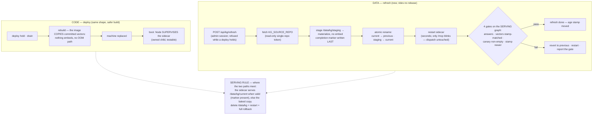

# Knowledge-graph architecture

End-to-end shape of the knowledge graph: the two repositories it spans, the technology at each
lifecycle stage, and the single fact that governs every operational decision — **the orchestrator
and the KG are one deployable unit.**

Reference for the configured KG source repository (set via `KG_SOURCE_REPO`; unset builds without a
sidecar — `/mcp` returns 503), its `kg_ingest/`, `kg_query/`,
and `snapshot/` directories, the KG stages of `Dockerfile`, `docker-entrypoint.sh`, and
`src/deploy.ts`. For the `/mcp` endpoint, the OAuth flow, and the ways a build ships degraded, see
[kg-sidecar.md](kg-sidecar.md). For deploy paths and their flags, see [deployment.md](deployment.md).

## The monolith

The orchestrator, the MCP proxy, and the knowledge graph's data ship in **one Docker image**, run in
**one Fly machine**, and carry **one release version**. There is no separate KG service, no separate
app, no separate lifecycle. The sidecar listens on `127.0.0.1:8765` and is unreachable from outside
the container.

This is a deliberate trade: it removes a service to operate, a network hop, and a second set of
credentials. What it costs is that graph data and orchestrator code cannot move independently. Six
consequences follow, and every one of them has surprised somebody.

### A data refresh is a code deploy

Updating the graph means building a new image and replacing the machine. `runDeploy` takes a deploy
hold first, so **dispatch stops**, then waits for in-flight work to drain — up to 75 minutes, after
which the deploy fails rather than interrupting a run. A KG refresh during a busy period therefore
either waits or fails.

Refreshing the graph is an operational event on the pipeline, not a data-only change. Plan it like
a release.

### A code deploy is a data refresh

The Dockerfile clones the KG repository with `git clone --depth 1` and **no ref pin**, so every build
takes whatever is on that repository's default branch (`main`) at that moment.

An orchestrator release that touches nothing about the KG will still re-materialize the graph from
the newest committed snapshot. **The graph's age stamp can change without anyone running a refresh.**
An operator who deploys a code fix and then finds the graph newer than they left it is seeing this,
not a bug.

The reverse also holds: a deploy picks up whatever snapshot is on the default branch when it builds.
The rail (`POST /api/kg/refresh`) is the only path that writes `snapshot/`; the laptop never pushes it.

### A broken snapshot blocks unrelated code deploys

Of the four KG build stages, three fail soft. The graph materialize step does not — it is the one KG
stage with no fallback, so a snapshot that will not parse fails the whole image build.

That is correct for the graph and awkward for everything else: while the KG default branch carries a
bad snapshot, **no orchestrator deploy succeeds**, including a fix for an unrelated production
problem. The recovery is to repair or revert the snapshot in the KG repository first.

### Rollback is all-or-nothing

Rolling the orchestrator back to an earlier release rolls the graph back with it. The two cannot be
versioned apart, because they are the same artifact.

### Coupling is at deploy time, not run time

The monolith does **not** couple availability. Sidecar failure is non-fatal at every stage: a missing
entry point, a crash, or a readiness timeout all leave `KG_SIDECAR_URL` unset and let the orchestrator
boot normally. `/mcp` degrades and every other route is unaffected.

So a dead graph never takes the pipeline down. Only a *deploy* joins their fates.

### Resources are shared

The machine runs at **1 GB** — raised from 256 MB for the sidecar in AII-322, and from 512 MB on
2026-09-08 when the refresh rail's materialize step was OOM-killed at ~31.6k quads (see the history
table). The published setup docs still describe 256 MB, which is right only for an orchestrator built
without the KG.

Memory is also shared at build time, and that has bitten once already: the embed step was OOM-killed
at ~21k quads once DocSection cards entered the graph (KGB-8). Growth in the graph is a constraint on
the image build, not only on query latency.

## The five stages

| Stage | Name | Where | Note |
|---|---|---|---|
| 1 | **Ingest** | local machine, python ≥ 3.10 | the only stage that fetches source data |
| 2 | **Commit** | git — `snapshot/parts/*.nt` | the transport between the repos |
| 3 | **Build** | Docker: node:24-slim + python venv | the graph is materialized here |
| 4 | **Serve** | Fly machine, 1 GB | lazy load on first query |
| 5 | **Access** | MCP client over HTTPS + OAuth | |

The repository boundary sits between stages 2 and 3. The configured KG source repository owns the
mechanism and the data. `AI-Implement` owns the image, the proxy, and the release.

### Stage 1 — Ingest

Runs on an operator's machine. **Nothing here runs in production**; the container ships no ingest path.

| Library | Role |
|---|---|
| `rdflib` >= 7.0 | Builds the graph. Every ingest module emits triples. |
| `pyshacl` >= 0.30 | Validates against `ontology/shapes.ttl`; reports `SHACL conforms`. |
| `python-frontmatter` | Parses ADRs, plans, and solutions docs into `kg:Decision` / `kg:Learning`. |
| `requests` | Linear GraphQL API. Raises without `LINEAR_API_KEY`, so a tracker run never silently produces an empty graph. |
| `beautifulsoup4` + `lxml` | Crawls documentation sites into `DocSite` / `DocPage` / `DocSection`. Imported lazily. |
| `pyyaml` | Reads `sources.yml`, the scope manifest. |
| `subprocess` → `git`, `gh` | The git spine: commits, files, PRs. No Python git binding. |
| `fastembed` + `numpy` | Builds the vector index. Imported lazily, so the core ingest never depends on them. |

The graph has two layers. The **spine** is deterministic — git, GitHub, tracker. The **semantic**
layer is parsed or extracted, and every node carries provenance. Vocabularies are `rdf`, `rdfs`,
`owl`, `prov`, `dcterms`, `skos`, `foaf`, `xsd`, defined in `ontology/kg.ttl`.

The ingest stamps `dcterms:modified` on the spine IRI before serialization (AII-326), so the age
lands in the committed snapshot rather than being computed at build time.

### Stage 2 — Committed formats

| Artifact | Format | Committed | Size |
|---|---|---|---|
| `snapshot/parts/*.nt` | N-Triples, split by subject type, sorted | Yes | ~5.7 MB |
| `snapshot/digest.md` | Markdown inventory, one line per issue | Yes | ~44 KB |
| `out/graph.trig` | TriG — the loadable form | No, gitignored | ~15 MB |
| `out/embeddings.npz` | NumPy zip: vectors, iris, types, titles, snippets, meta | No, gitignored | — |

Determinism is the point. No blank nodes, stable IRIs from stable keys, everything sorted, no
timestamps in the parts. Identical data produces identical bytes, so a tracker refresh shows a diff
in `issue.nt` and `comment.nt` and nothing else. `cat snapshot/parts/*.nt` reconstitutes the graph,
which makes the parts a checked-in backup as well as a transport.

### Stage 3 — Image build

| Step | Technology | On failure |
|---|---|---|
| Clone the KG repo | BuildKit `--mount=type=secret` | Soft — sidecar-less image |
| `pip install` into `/app/kg/.venv` | `python3 -m venv` | Soft |
| Warm the model | `fastembed`, ONNX into `FASTEMBED_CACHE_PATH` | Soft — lexical only |
| Materialize `--no-embed` | `rdflib` reads `*.nt`, writes `graph.trig` | **Hard — build fails** |
| Materialize with embed | `fastembed` + `numpy` | Soft — writes `.embeddings-failed` |

The base image is `node:24-slim`, not Alpine: `fastembed` and `onnxruntime` ship glibc wheels only.

Every soft failure that skips real work must leave a receipt. The embed step writes
`/app/kg/.embeddings-failed`, which `docker-entrypoint.sh` turns into `KG_EMBEDDINGS_DEGRADED=1` at
boot, surfaced as `kgDegraded` on `GET /`, in the deploy notification, and in `get_tenant_health`
(AII-422). See [deployment.md](deployment.md#kg-embeddings-health).

### Stage 4 — Serve

**Python sidecar** on `127.0.0.1:8765`:

| Library | Runtime role |
|---|---|
| `mcp` (FastMCP) | The MCP server. `transport="streamable-http"` under `KG_HTTP=1`, else stdio. |
| `rdflib` | The database. Parses `graph.trig` into a `Dataset`, flattens quads into one union `Graph`, runs SPARQL SELECT in process. |
| `numpy` | Cosine similarity as one normalized matrix-vector product. No ANN index at this scale. |
| `fastembed` | Embeds the **query** at request time — `BAAI/bge-small-en-v1.5`, 384 dimensions, ONNX, no torch. |
| `requests` | Only under `KG_BACKEND=stardog`. That seam is evaluated, not committed. |

**Node orchestrator**, same container:

| Library | Runtime role |
|---|---|
| `node:http` / `node:https` | `src/mcp.ts` is a hand-written JSON-RPC proxy. It uses no MCP SDK. |
| `openid-client` | OIDC delegation for `/mcp/authorize`. |
| `node:crypto` | PKCE, auth codes, token hashing. |
| `better-sqlite3` | `mcp_refresh_tokens` and the rest of the SQLite file. |

**Loading is lazy.** Three singletons build on first use, not at boot: the store parses `graph.trig`
on the first `kg_*` call, the index reads `embeddings.npz` on the first semantic query, and
`TextEmbedding` loads ONNX weights from the baked cache once.

The entrypoint's readiness poll only proves the port accepts connections — any HTTP response counts.
The first real query pays the parse and the model load. **Booting is not serving**, and this is why.

### Stage 5 — Search behaviour

`kg_hybrid_search` is the preferred tool. It fuses lexical SPARQL and vector cosine with Reciprocal
Rank Fusion (`RRF_K = 60`). An exact-identifier boost of `1.0` dominates any RRF sum (~0.03), so issue
keys and `SCREAMING_SNAKE` flags lead. A missing index sets `degraded: true` and returns lexical
results; it never raises.

Six read-only KG tools: `kg_search`, `kg_semantic_search`, `kg_hybrid_search`, `kg_neighbors`,
`kg_provenance`, `kg_path`. The orchestrator adds its own diagnostics — `get_tenant_health`,
`list_projects`, `get_fleet_report` and others — which answer from SQLite and need no sidecar.

## Freshness

**There is no runtime ingestion.** Nothing crawls or re-materializes while the orchestrator runs.
Graph age has two inputs: when the snapshot was committed, and when the image was built. A perfectly
healthy sidecar can serve a months-old view, and nothing in a query response says so.

The one reliable signal is `dcterms:modified` on `https://kg.builddown.dev/resource/graph/spine`,
read with `kg_neighbors`. Compare it against the ingest date. An unchanged stamp after a deploy means
the build served the old snapshot — usually because the push had not landed, or because the remote
builder's git cache served a stale `--depth 1` clone. Both are benign. Wait, redeploy, re-verify.

## Process: refreshing the graph

With the refresh rail (AII-426), publishing data no longer rides a release. Run `bd-kg-refresh`,
or these steps by hand.

1. Reconcile scope in `sources.yml` (through a PR on the KG repo when it changes) — the rail runs the ingest and pushes the snapshot itself; no laptop ingest, no laptop push.
2. **Trigger the refresh**: `POST /api/kg/refresh` with an admin session token (or the
   Deployments page's "Refresh graph now"). `202` = accepted; `409` = a refresh or a deploy is
   already in progress; `422` = callback not configured or credential preflight failed (see below). The orchestrator
   first runs a **credential preflight** (probing the KG write token and the installation-wide
   dependency token against every `code_repo` and `secondary_repos` slug in `sources.yml`) and
   returns `422 preflight-failed` immediately if any grant is missing — before any dispatch or
   staging attempt. The preflight also adds an advisory `base:drift` row (AII-598) reporting how
   many commits the KG repo is behind `sources.yml`'s `base_repo:` key (default
   `BuildDownAI/bd-knowledge-graph-base` when absent) — it never contributes to the 422 refusal,
   it only informs. Then it checks whether the source repo snapshot SHA matches the last recorded SHA:
   - **If the SHA differs** (new snapshot available): fetches `KG_SOURCE_REPO`, stages under
     `/data/kg/staging` (materialize with the image's venv — nothing embeds; see "Two materialize
     paths" below for the `KG_MATERIALIZE_DIRECT` flag), writes the completion marker last, swaps
     by rename, and restarts the sidecar.
   - **If the SHA matches** (AII-495): dispatches a `kg-refresh` Claude runner job to ingest
     and push a new snapshot. Requires `RUNNER_CALLBACK_BASE_URL` and `RUNNER_TOKEN_SECRET`;
     without them the trigger returns `422 callback-unconfigured`. The stage advances from
     `ingest-running` to `snapshot-landed` when the runner reports back, then the local rail
     runs as above.
3. **The four gates run on the serving graph**: the sidecar answers; the vectors are present;
   a canary query returns non-empty with `degraded: false`; and the served age stamp is
   strictly newer than before the swap. Any failure reverts to the previous overlay and
   restarts again. `GET /api/kg/status` reports the outcome and the gate that fired.

`GET /api/kg/status` exposes a `stage` field with fine-grained lifecycle states:

| Stage | Meaning |
|---|---|
| `idle` | No refresh in progress |
| `checking` | Refresh triggered; comparing snapshot SHA against last recorded |
| `ingest-running` | Runner job dispatched; waiting for callback |
| `snapshot-landed` | Callback received; snapshot commit verified |
| `staging` | Local rail running (fetch → materialize → swap) |
| `serving` | Rail succeeded; sidecar serving new graph |
| `reverted` | Gate failed; rolled back to previous overlay |
| `failed` | Terminal failure (ingest, snapshot verification, or staging) |

Stage is persisted to the DB so a restart mid-rail fails fast (stage → `failed`) rather than
blocking all future refreshes for the remainder of the 4-hour ingest TTL. A live process that
dispatched a runner and received no callback within the TTL self-heals at the next `POST
/api/kg/refresh` call.

**Redeploy remains the path for code, not data** — a change that touches the sidecar's code rather
than its data ships by deploy, and the image build reads whatever snapshot is on the KG repo's default
branch at that moment (the rail keeps it current):

1. **Refresh the data first if it must be current** — `POST /api/kg/refresh`, wait for `serving`.
2. **Self-deploy** — `POST /api/deploy` with an admin session token. Expect `202`, or `409` if one is
   already running. Never a plain `fly deploy`; see [deployment.md](deployment.md#deploy-paths).
3. **Verify live.** Non-empty results, `degraded: false`, and an age stamp equal to the served stamp
   from step 1. Check `kgDegraded` on `GET /` as well — a lexical-only image answers queries and looks
   healthy.

An orchestrator that predates the rail (the route answers 404) is upgraded, not worked around: the
laptop ingest-and-push path is retired (AII-593), and `snapshot/` on the default branch is written by
the rail alone.

Steps 5 to 7 exist entirely because of the monolith. In a two-service design the data would be
reloadable on its own; here it rides a release, so the release has to be sequenced and verified.

### Scope contract

The orchestrator's project mappings are the scope for `sources.yml`. The `kg-scope-reconcile`
pipeline step (`src/pipeline/steps/kg-scope-reconcile.ts`, [docs/issueless-runs.md](issueless-runs.md)
§5 "Scope endpoint") runs on every refresh, on the refresh branch, before ingest: it fetches the
mapping set from `POST /api/runner/kg-scope` and additively maintains the manifest — each mapped
repo not already `code_repo` or an existing `secondary_repos` entry is added as a secondary (the KG
repo itself is skipped — it self-ingests and is never its own secondary), and
each mapped team not already present is added to `trackers`. It **never removes** an entry (a
repo or team decommissioned on the orchestrator side stays in `sources.yml` until an operator
prunes it by hand) and **never touches `docs_sites` or `code_repo`'s `docs_url`** — doc roots stay
entirely operator-owned, maintained through `bd-mega-kg-refresh` rather than this rail. A refresh
with nothing to add logs `scope in sync` and leaves the file byte-for-byte unchanged.

## Refresh rail implementation (AII-426, AII-495)

[AII-426](https://linear.app/eudoxus/issue/AII-426) shipped the local refresh rail; the "Planned"
tracking issue was [AII-424](https://linear.app/eudoxus/issue/AII-424). AII-495 extended it with
runner dispatch for the ingest step. The six children (KGB-9, KGB-10, KGA-3, KGA-4, AII-425,
AII-426) are all landed. The redeploy path remains for code changes or sidecar updates.

### What changes, and what deliberately does not

- **The image keeps baking a graph.** The runtime copy at `/data/kg/current` is an overlay the
  sidecar prefers when present. Deleting it and restarting returns the orchestrator to exactly
  the behaviour this doc describes — that is the rollback path.
- **"A data refresh is a code deploy" stops being true.** A refresh restarts only the sidecar:
  no deploy hold, no dispatch pause, no drain. `/mcp` blinks for a few seconds — already a
  non-fatal condition.
- **"A code deploy is a data refresh" stays true.** The build still clones the configured KG
  source repository's default branch unpinned, so a release still re-materializes the graph.
  The overlay then wins over whatever the release baked. The refresh fetches that same
  configured repository (`KG_SOURCE_REPO`), never a hard-coded slug.
- **The embeddings become a committed artifact** (`snapshot/embeddings.npz`, written with
  `np.savez_compressed`), because the serving machine can never compute them — KGB-8's OOM is
  the proof. The graph stays derived; only the vectors ship. Measured 2026-08-21 at ~21k quads:
  12.0 MB uncompressed (7.0 MB of it fixed-width-column zero-padding), 2.5 MB compressed.
  Peak refresh footprint on disk is ~75 MB against the 1 GB volume — tenfold headroom. Resident
  memory is the tighter budget: the rail's materialize runs as a second Python process beside the
  serving sidecar, and at ~31.6k quads it reached 271 MB RSS — which is what the 512 MB machine
  could not hold on 2026-09-08.

### Two materialize paths (AII-599)

`KG_MATERIALIZE_DIRECT=true` switches the refresh rail to the base repo's low-memory `--direct`
path (KGB-15, base PR #34), gated behind the flag because it requires the configured
`KG_SOURCE_REPO` derivative to already carry that base change — an image whose venv predates it
fails the materialize step and the rail reverts safely, same as any other staging failure.

| | Off (default) — rdflib | On — `--direct` |
|---|---|---|
| Materialize command | `python -m kg_ingest.materialize` | `python -m kg_ingest.materialize --direct` |
| What it does | Parses `snapshot/parts/*.nt` with rdflib, re-serializes to `out/graph.trig` | Copies `snapshot/parts/*.nt` to `out/parts/` — no rdflib re-serialization |
| Staged as | `stagingDir/graph.trig` | `stagingDir/parts/` |
| Served with | `KG_BACKEND` unset (start.sh's own `rdflib` default) | `KG_BACKEND=nt_parts`, `KG_PARTS_DIR=<current>/parts` |
| Peak refresh RSS (31k triples) | ~99 MB | ~29 MB |

The sidecar derives which backend to serve from what is actually staged on disk (a `parts/`
directory next to the completion marker), not from re-reading the flag — `kg-sidecar.ts` is
spawned fresh on every `restart()`, so this keeps a `current/` overlay self-describing even if the
flag changes between refreshes. With the direct path, the refresh process's own footprint drops
low enough that serving and refreshing together fit comfortably inside the 512 MB the machine
could not hold on 2026-09-08 with the rdflib path (see the Failure history table) — the 1 GB
figure above remains the committed setting, but the direct path is what would let that incident's
fix be reverted instead of the memory bump.

### The `index.ts` budget

Full separation from `index.ts` is not achievable, because reuse forbids it: admin auth reaches
a route only through `handleAdminRequest` → `AdminDeps` → `index.ts`, and an endpoint anywhere
else would mean a new public surface and a new credential. The design is therefore a budget,
not an absence — `index.ts` gains exactly **one config field, one supervisor construction, one
`main()` lifecycle hook, and one `AdminDeps` entry**. All logic lives in injected-dependency
modules (`src/kg-sidecar.ts`, `src/kg-refresh.ts`), built in the `makeStartDeploy` shape from
the start. No new top-level function, no new route branch.

### Invariants the refresh must hold

- **Atomic overlay.** `current` is only ever created by a rename of a fully staged directory
  whose completion marker was written last. Boot ignores a `current` without the marker, so a
  crash mid-stage can never mask the baked fallback.
- **Respect the deploy hold.** A manual refresh refuses while a deploy holds; an automatic mode,
  when it lands, rides the existing poll loop the way the availability passenger does — never
  its own timer, because the hold is only observed from that loop.
- **Four gates, after the restart** — sidecar answers; vectors present and stamp-matched;
  canary query non-empty and `degraded: false`; served age stamp strictly newer. Validating the
  serving graph rather than a staged copy keeps memory at one graph. Any gate failing reverts
  to `previous` and restarts again.
- **Signals are the supervisor's problem.** Once Node spawns the sidecar instead of the shell
  `exec` chain, the orchestrator owns forwarding, reaping, and a bounded kill — a child must
  never outlive shutdown or block it.

## kg-refresh run kind

AII-493 adds a `kg-refresh` runner pipeline. The ingest runs as a **deterministic pipeline step**
(`src/pipeline/steps/kg-ingest.ts`): `kg-ingest` spawns `python -m kg_ingest refresh` as a
subprocess, streams its output, and on success writes `ai-output/kg-stats.json` from CLI-emitted
stats or a fallback `.nt` line count. No agent runs after it: the step's echoed counters and
`ai-output/kg-ingest.log` (AII-581) are the run's report, and `kg-snapshot-push` is the guard. The
report step that once followed was removed on 2026-09-08 after it re-ran the ingest by hand and
deleted `snapshot/parts/pr.nt`. AII-494 adds the two
runner-callback endpoints that give this run kind its privileged access without ever vending a
long-lived credential to the runner. AII-495 wires `POST /api/kg/refresh` to dispatch the runner
when the source repo has no newer snapshot: the orchestrator mints a run token, encodes a
`RunConfigV1` with `runnerPhase: "kg-refresh"`, and dispatches via Fly Machines or local Docker.
When the runner completes, it calls `POST /api/runner/result` which routes to `onRunnerComplete` in
`src/kg-refresh.ts`. If a `snapshotCommit` SHA is included, the orchestrator verifies the commit is
visible via the GitHub API (one retry for git-cache lag) before starting the local staging rail.

The tracker-data callback endpoint requires a `kg-refresh`-phase progress token (multi-use, `consume: false`);
any other phase or a missing/invalid token receives `403 Unauthorized` with no distinguishing body.
The orchestrator performs all external writes with its own credentials; the runner receives only the
requested data.

**Code-repo in the workspace (AII-564, child 1).** Both run tokens for a kg-refresh dispatch are minted with the team key of the KG source repo's own project mapping (the mapping whose `owner/repo` equals `kgSourceRepo`), so the dependency-token endpoint can locate that mapping and check its `dependencyTokenScope` setting; if the mapping has `dependencyTokenScope = "installation"`, the endpoint vends the token and activates
the `dependency-auth` step, which mints an installation-wide `contents: read` token and installs
it as a git credential helper (the existing dependency-auth mechanism — no new token kind). A
`clone-code-repo` step (type: `clone`) then reads the `code_repo: owner/repo` field from
`sources.yml` in the KG workspace and clones it with `--depth 1` into `code-repo/` alongside the
KG workspace. The step is registered by type (`clone`) so the runner resolves it via the standard
`cloneStep` — no separate registration. If `dependency-auth` did not acquire a token (absent
callback URL, local run, or fetch failure), `clone-code-repo` is skipped gracefully and the ingest
proceeds without the code repo rather than aborting the pipeline. When the clone succeeds, the
`kg-ingest` step passes `--code-repo <path>` to `python -m kg_ingest refresh`, giving the ingest
access to git history, commits, PRs, and files from the implementation repo. If `sources.yml`
contains no `code_repo` field, the step is also skipped silently. The dev-harness `--phase kg-refresh`
run (`docs/issueless-runs.md` § 10) exercises the same clone steps locally against the operator's
GitHub token; it never pushes.

| Endpoint | Method | Purpose |
|---|---|---|
| `/api/runner/kg-tracker-data` | POST | Returns one paginated page (50 issues) of Linear issues for the run's team, including comments. The orchestrator performs the read; no Linear credential ever leaves the orchestrator. |

The snapshot push step (`src/pipeline/steps/kg-snapshot-push.ts`) calls `refreshRunnerGithubCredentials`
immediately before the push — the same pattern as `push.ts`. In Fly/local-docker mode this re-mints
a fresh token via the machine nonce; in GHA mode it is a no-op (no publication token for kg-refresh)
and the dispatch-time `GITHUB_TOKEN` is used directly.

**Snapshot push contract — content-based, not flag-based.** `kg-snapshot-push` judges the
snapshot by comparing the working tree's `snapshot/parts/*.nt` line counts against the cloned
HEAD before committing. The push is refused with `KG_SNAPSHOT_TRACKER_REGRESSION` if any of the
following hold:

| Rule | Condition |
|---|---|
| Missing part | A part file present in the previous snapshot is absent from the working tree |
| General shrink | Any part file's line count is below `PART_SHRINK_THRESHOLD` (50 %) of its previous count |
| `issue.nt` / `comment.nt` zero-shrink | `issue.nt` or `comment.nt` shrinks by any amount when the `kg-tracker-data` step reported a non-zero `issueCount` |

One log line listing all parts with `prev=` and `new=` counts is emitted on every push attempt,
pass or fail. The `fetched=false` flag check (which guards against a docs-only push replacing a
tracker-enriched graph) is a separate, prior guard; both must pass before a commit is made.

**Fly session image pinning (AII-534, updated AII-555).** `dispatchKgRefreshRun` resolves the
session machine image via `resolveRunnerImageForDispatch` (`src/repo-image.ts`), the same
function the standard implement and planning dispatch paths use. Resolution order:

1. Per-repo `.ai-implement/image.yml` override always wins.
2. An explicit orchestrator-wide default (`AI_IMPLEMENT_RUNNER_IMAGE` or legacy `SESSION_IMAGE`).
3. Falls back to `undefined` — the target workflow's own `AI_IMPLEMENT_RUNNER_IMAGE` variable
   (if set) applies, then the workflow's built-in default image.

The source-commit pairing policy that pinned each run to the exact runner image baked at the
same orchestrator commit (via the deleted `resolveKgRefreshSessionImage`) was removed by AII-557:
it required an anonymous registry round-trip on every dispatch, and the channel tag (`latest` /
`next`) already tracks the correct image pair for both the implement and kg-refresh paths.

## Failure history

Each of these shipped a degraded or blocked deploy, and each is now covered by a guard.

| Date | Failure | Fix |
|---|---|---|
| 2026-08-07 | Sidecar deployed by hand from an rsync'd tree; `kg/` empty in git, machine at 256 MB | AII-322 — build-secret clone, materialize from snapshot, 512 MB committed |
| 2026-08 | "No embeddings" reports blamed on the embed step | AII-323 — it was the Docker layer cache reusing a stale materialize layer; a build secret is not a cache key, so `--no-cache` is mandatory |
| 2026-08 | Model fetched from the network at build and at query time | AII-323 — bake the model into `FASTEMBED_CACHE_PATH`, warm it as its own step |
| 2026-08 | Type-filtered tools returned empty against a loaded graph | `sources.yml` missing from the image; without it the server falls back to a placeholder IRI namespace |
| 2026-08-18 | Self-deploy v111 built the previous snapshot; v112 minutes later was correct | Remote-builder git-cache lag on a `--depth 1` clone — wait and redeploy |
| 2026-08-19 | v115 shipped lexical-only after the embed step was OOM-killed at ~21k quads / 1,438 cards | KGB-8 — free the rdflib graph before embedding, pre-allocate the output array, embed in slices of 64 |
| 2026-08-20 | A degraded build was indistinguishable from a healthy one | AII-422 — `.embeddings-failed` receipt, `KG_EMBEDDINGS_DEGRADED`, `kgDegraded` on health, notification, and `get_tenant_health` |
| 2026-09-08 | First guard-clean, stamp-clean run (34273291848) failed at the push with 403: `origin` was bare and the first credential helper to answer for github.com was dependency-auth's read-only token, not the kg-push helper | `kg-snapshot-push` pushes with the primary token in the origin URL, the `push.ts` shape; the kg-push helper is no longer consulted (its deletion is AII-583) |
| 2026-09-08 | With the report step gone, the stale-stamp gate read `snapshot/embeddings.stamp`, a file only hand edits and that agent ever wrote; the first guard-clean run (34270413381) failed `KG_SNAPSHOT_STALE` on it | The gate reads `age_stamp` from `snapshot/embeddings.meta.json` — the ingest's own stamp and the one the rail's materialize checks — with the legacy file as fallback |
| 2026-09-08 | The kg-refresh report step (feedback-loop) re-ran the ingest by hand without a GitHub token and rewrote `snapshot/parts/` without `pr.nt`; the guard refused three runs | The report step is removed from `pipelines/kg-refresh.yml`; the ingest step's counters and `ai-output/kg-ingest.log` (AII-581) plus the snapshot-push guard are the report |
| 2026-09-08 | Refresh rail's materialize OOM-killed at ~31.6k quads (271 MB RSS beside the serving sidecar on a 512 MB machine); the rail refused the swap and kept serving the old graph | `fly.toml` memory raised to 1 GB — the documented headroom figure, not a code change |

## KG-refresh outcome visibility (AII-496)

Every terminal outcome (success, no-new-data, failure) calls `handleKgRefreshOutcome` in
`src/index.ts`, which drives two visibility surfaces:

**Webhook notification** (`NOTIFY_WEBHOOK_URL` + `NOTIFY_TYPE`). `notifyKgRefreshOutcome` in
`src/notify.ts` sends a Slack or Teams message for every outcome. Failure messages include a
human-readable classification from `classifyCompletion` (phase `kg-refresh`) plus the failure code
or reason. A TTL-timeout outcome is classified as `status: "timed_out"` so the notification reads
"KG Refresh hit the time limit." rather than the generic "KG Refresh failed." The function
parallels the existing `notifyCompletion` shape: one function per provider, a shared label helper.

**Failure report issue** (`kg_refresh_report_issue` admin setting, saved via `/api/settings`).
When set to a Linear issue key (e.g. `AII-99`), a failure outcome posts a comment on that issue
with the classification text, failure code / reason, and dispatch ID. The orchestrator finds the
Linear mapping and calls `provider.postComment` with its own credentials; no credential ever
leaves. Only the first Linear mapping (sorted alphabetically by project key for determinism) is
used — a multi-Linear-workspace scenario would need a designated-mapping concept, which is not
yet implemented.

**Stuck-watchdog carve-out.** `remediateStuckJob` and `remediateFailedJob` in
`src/stuck-watchdog.ts` both return early when `job.phase === "kg-refresh"`. This is
forward-proofing: kg-refresh jobs are not yet tracked in `dispatch_log` (they use the
`onRunnerComplete` callback path via `runner-callback.ts` instead), so
`getInFlightJobs()`/`monitorJobs()` never routes one into those remediation functions. The guard
is in place so that if kg-refresh jobs are ever logged, the watchdog does not attempt to reset or
close them the way it does for implementation jobs.

**Exactly-once guarantee.** A failed run produces exactly one webhook notification and, when the
report issue is configured, exactly one tracker comment. The stage guard added to `onRunnerComplete`
(`if (stage !== "ingest-running") return;`) prevents a late runner callback from re-entering the
critical section after the TTL watchdog has already resolved the run.

## Retrospective: the dispatched refresh (2026-09-03 → 09-06)

### Retrospective — what happened

AII-495 wired `POST /api/kg/refresh` to dispatch a Claude runner when the source repo has no newer snapshot. On 2026-09-03, a refresh was triggered on the testing orchestrator for the first time with runner dispatch enabled. Two bugs blocked the run from completing; both were diagnosed and fixed within the window.

**AII-544 — progress token not minted.** `dispatchKgRefreshRun()` minted only a result token (`audience: "result"`). The `POST /api/runner/kg-tracker-data` endpoint gates on `audience = "progress"`, so the runner received 403. The `kg-tracker-data` step no-oped silently (`RUN_PROGRESS_TOKEN` absent → early return). Fix: mint a progress token alongside the result token and pass it as `RUN_PROGRESS_TOKEN` in `extraEnv`.

**AII-548 — `runnerCallbackUrl` carried the full result URL.** The `RunConfigV1` field was set to `RUNNER_CALLBACK_BASE_URL + "/runner/result"` (the full callback URL) instead of the bare base URL. Every runner-side client that appended its own path produced a doubled path — `/runner/result/runner/result`, `/api/runner/kg-tracker-data/runner/result`, etc. — all of which hit the admin-auth wall and returned 401. Fix: `runnerCallbackUrl` is always the bare base URL (e.g. `https://my-orchestrator.fly.dev`); each client is responsible for appending its own path suffix. This contract is now documented in `docs/issueless-runs.md` §3.

After both fixes landed, the review of the implementation also identified an architectural pattern: the kg-refresh dispatch introduced several sibling files alongside existing ones rather than parameterizing the originals. The architecture table below names each pairing and records the cleanup issues so the next issueless run kind starts from the shared list rather than repeating the same proliferation.

### Architecture — what is shared and what is kg-refresh-only

| Component | Shared / existing path | kg-refresh-only path | Status |
|---|---|---|---|
| GHA workflow | `workflows/claude-implement.yml` with `runner_phase: "kg-refresh"` | `workflows/claude-kg-refresh.yml` | removed by AII-556 ✓ |
| Runner-side pipeline | *(step sequence in `WORKFLOW.md`)* | `pipelines/kg-refresh.yml` | present |
| Session image resolution | `src/repo-image.ts` `resolveRunnerImageForDispatch` | `src/repo-image.ts` `resolveKgRefreshSessionImage` | removed by AII-557 ✓ |
| Orchestrator state machine | — | `src/kg-refresh.ts` | present |
| Pipeline entrypoint | — | `src/pipeline/kg-refresh-run.ts` | present |
| Tracker data step | — | `src/pipeline/steps/kg-tracker-data.ts` | present |
| Snapshot push step | — | `src/pipeline/steps/kg-snapshot-push.ts` | present |
| Push credential | `src/pipeline/steps/push.ts` `refreshRunnerGithubCredentials` | — | removed by AII-583 ✓ |
| Callback routing | `src/runner-callback.ts` (carve-out within shared file) | — | present |
| Dispatch function | — | `src/index.ts` `dispatchKgRefreshRun` | present |

The rule for future run kinds: prefer a parameter of an existing file over a new sibling. Each row in the "kg-refresh-only" column that has a "shared / existing" counterpart is a finding — `claude-kg-refresh.yml` should have been a parameterized call to `claude-implement.yml`, `resolveKgRefreshSessionImage` should have been a parameter of `resolveRunnerImageForDispatch`, and the kg-push credential helper should have reused `refreshRunnerGithubCredentials` from the standard push step. AII-556, AII-557, and AII-583 collapse those pairs. Rows with no shared counterpart (the state machine, pipeline steps) are legitimately kg-refresh-only and belong exactly where they are.

## Lineage

| Wave | Issues | Result |
|---|---|---|
| MCP endpoint | AII-296, AII-297, AII-302 | `/mcp` route, OAuth, single-machine deploy |
| Durable image | AII-322, AII-323 | Build-secret clone, materialize from snapshot, baked model |
| Shared graph | AII-324, AII-326, AII-327, AII-328, AII-329 | Orchestrator KG as source of truth, age stamp, skills migrated |
| Usability | AII-346 | Refresh tokens — hourly re-auth was unusable |
| Deploy ownership | AII-353, AII-355 | Self-deploy, source stamps, availability |
| Docs ingestion | KGB-2 through KGB-5, KGA-2, BDS-38 | Crawl, section chunks, citable anchors |
| Scaling | KGB-8, AII-422 | Bounded-memory embedding, and a receipt when it still fails |
| Autonomous ingest | AII-493, AII-494 | kg-refresh run kind: Claude runner follows the ingest playbook; runner-callback endpoint vends tracker data; snapshot push uses the standard credential-refresh path |
| Autonomous ingest | AII-493, AII-494 | kg-refresh run kind: runner-callback endpoints vend scoped push token and tracker data |
| Deterministic ingest step | AII-571 | kg-ingest is a deterministic pipeline step; the report step that followed it was removed on 2026-09-08 (see the history table) — no agent runs in a kg-refresh workspace |
| Runner dispatch + stage machine | AII-495 | `POST /api/kg/refresh` dispatches the runner when ingest is needed; persisted stage machine (idle → checking → ingest-running → snapshot-landed → staging → terminal) survives restarts; live TTL watchdog; `/admin#deployments` stage badges |
| KG-visible outcomes | AII-496 | Slack/Teams notification + Linear failure comment on every terminal outcome; TTL-timeout reaches the "hit the time limit" classifier; stuck-watchdog carve-out; exactly-once guarantee via stage guard |
| Credential preflight | AII-585 | `runKgRefreshPreflight` probes KG write token and code/secondary-repo read tokens synchronously in `trigger()` before dispatch; returns `422 preflight-failed` on any missing grant; result exposed in `get_tenant_health` as `kgRefreshPreflight`; gate `"preflight"` added to `RefreshGate` |
