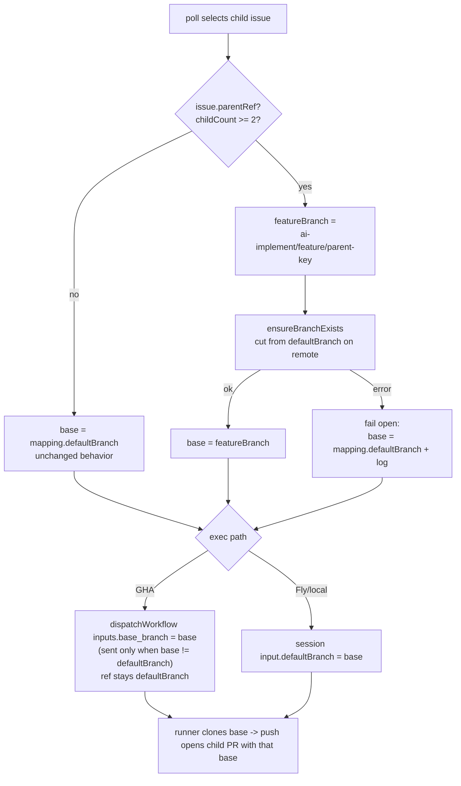

# feat: Feature Branches for Parent/Child Linear Issues

> **Scope note (v1 = grouping only).** This plan deliberately ships the *simplest* slice:
> children of a multi-child Linear parent get their PRs **grouped onto a shared feature branch**
> cut from the repo's base branch. A human opens the final feature→base PR with one click when
> the feature is ready. The **auto-open merge-up monitor** (orchestrator opens feature→base
> automatically) is an explicit **deferred follow-up** — a `ce-doc-review` pass showed it carried
> ~80% of the complexity and risk (a persistent registry, per-poll Linear polling, and a
> readiness trigger that depended on human actions the orchestrator never performs). Dropping it
> removes the new SQLite table, the merge-up monitor, and the entire Linear↔GitHub state-
> disagreement class of bugs, while still delivering the core goal.

## Summary

AI-Implement dispatches one run per Linear issue, and every resulting PR targets a single branch
per repo — `mapping.defaultBranch` (commonly `testing`, not `main`). When a large piece of work
is split into a **parent issue with several child issues** (e.g. OOL-78 → OOL-86…93), all child
PRs land on the base branch independently, with no way to review the feature as one unit.

This plan makes the orchestrator **automatically target a parent's child PRs at a shared feature
branch** named deterministically from the parent (`ai-implement/feature/<parent-key>`) and cut
from the repo's base branch. Children clone from and PR into that feature branch; a human merges
children into it and opens the single feature→base PR when ready.

The change exploits an existing runner property — a PR's base is derived from the branch the
runner clones (`GITHUB_DEFAULT_BRANCH` → clone → `push` PR base) — so the whole feature is
concentrated in **dispatch-time branch resolution** plus one new GHA workflow input. No new
persistent state, no poll-loop monitor, and `src/pipeline/steps/push.ts` is untouched.

---

## Problem Frame

- **Today:** the base branch is effectively hardcoded. `src/github.ts:68` dispatches with
  `ref: mapping.defaultBranch`; session paths set `GITHUB_DEFAULT_BRANCH: input.defaultBranch`
  (`src/fly-machines.ts:369`, `src/local-docker.ts:60`); the runner clones that branch and
  `src/pipeline/steps/push.ts` opens the PR with `base: clone.branch` (wired at
  `src/pipeline/pipeline-loader.ts:143`). Parent/child relationships are read **only** for
  planning (`src/planning-context.ts`), never for implementation dispatch.
- **Latent bug (fixed here):** the GHA path never sets `GITHUB_DEFAULT_BRANCH`, so it always
  clones `main` regardless of `mapping.defaultBranch` (`session/entrypoint.sh:49` defaults to
  `main`). Repos using `testing` as their base on the GHA path are silently broken today; U5
  fixes this as a side effect.
- **Consequence:** sibling PRs can't be grouped or reviewed as one feature.
- **Desired outcome:** children of a multi-child parent share a feature branch; a human merges
  them and opens one feature→base PR.

---

## Terminology (used consistently below)

- **base branch** — the repo's configured default, `mapping.defaultBranch` (often `testing`).
- **feature branch** — `ai-implement/feature/<parent-key>`, cut from the base branch.
- **PR base / target** — the branch a child's PR opens into (the feature branch when grouped,
  else the base branch).

---

## Requirements

- **R1** — A child whose parent has **≥2 children** targets the feature branch instead of the
  base branch. Solo-child parents and parentless issues behave exactly as today.
- **R2** — The feature branch is cut from the base branch and named deterministically
  `ai-implement/feature/<slug(parent-identifier)>` — derived from the **parent identifier only**
  (stable; no title drift), so no registry is needed to recover the name on later dispatches.
- **R3** — A child both **clones from** and **opens its PR into** the feature branch, so a later
  child builds on whatever siblings have **already been merged into the feature branch at clone
  time**. (Children dispatch in parallel as they unblock; merge ordering is not enforced by this
  feature — Linear `blocks` relations remain the sequencing mechanism. Parallel children may
  clone a not-yet-updated feature branch and require conflict resolution at merge — see Risks.)
- **R4** — Works on **both** execution paths: the GitHub-Actions workflow path and the
  Fly/local-docker session-runner path.
- **R5** — The final **feature→base PR is opened by a human** (one click in GitHub). The
  orchestrator never opens or merges it in v1.
- **R6** — Linear only. A Jira-parented child (or any non-Linear provider) behaves as today.
- **R7** — Idempotent and crash-safe: re-dispatch, the `both` shadow path, or a restart never
  creates duplicate branches and never strands a child.

---

## High-Level Technical Design

Dispatch-time branch resolution (computed **once per issue at the call site**, then passed into
whichever dispatch path runs):

Then: humans merge child→feature PRs, and a human opens the feature→base PR when the feature is
complete. The orchestrator's involvement ends at child dispatch.

The `push` step is unchanged — setting the runner's clone branch to the feature branch makes both
clone-source and child-PR base follow automatically.

---

## Key Technical Decisions

- **KTD1 — Drive the PR base through the existing clone branch, not `push.ts`, resolved once per
  issue.** Setting `GITHUB_DEFAULT_BRANCH` (session) / `base_branch` input (GHA) to the feature
  branch makes both clone-source and child-PR base follow, with zero change to
  `src/pipeline/steps/push.ts`. Compute `baseBranch` **once** in the `poll()` per-issue loop
  (before the exec-path switch / `both` shadow split) and pass it into each dispatch function —
  the `both` shadow path calls two dispatch functions for the same issue (`src/index.ts:280-281`),
  and resolving per-function could make GHA and Fly target **different** bases under a fail-open.
  *Rationale:* smallest blast radius; stacking (R3) falls out because later children clone the
  feature branch. **Verified** against `pipeline-loader.ts:143`, `push.ts:35/91`, `clone.ts:62/83`.
- **KTD2 — Orchestrator creates the branch before dispatch.** `ensureBranchExists` runs in the
  dispatch path so the base ref exists before the runner pushes. *Rationale:* avoids a race where
  the runner opens a PR against a non-existent base; one idempotent creation point (also covers
  restart safety and the `both`-path double-call).
- **KTD3 — No persistent state.** The feature-branch name is deterministic from the **parent
  identifier**, so we never need to store or recover it. *Rationale:* this is the single biggest
  simplification — it removes the SQLite table, the per-poll Linear polling, the merge-up monitor,
  and all the registry-lifecycle/cleanup concerns the review surfaced. The only "state" is the
  branch itself on GitHub. **Precondition:** collision-freedom of the name rests on Linear issue
  identifiers being unique and slug-safe (`[A-Z]+-\d+`) within a workspace — true for Linear, so
  no collision check is needed. Any future non-Linear parent support (out of scope, R6) must
  re-validate this before reusing the deterministic-name approach.
- **KTD4 — Fail open on resolution failure.** If `ensureBranchExists` (or the parent fetch) errors,
  log and use `mapping.defaultBranch` so the child still dispatches. *Rationale:* grouping is an
  enhancement, not a gate. **Honest limitation:** the mis-routed child has already consumed its
  dispatch (dedup), so it is *not* auto-corrected on the next poll — that one child lands on base
  while siblings group. Acceptable for v1; a human can re-route if it matters.
- **KTD5 — Only send `base_branch` to GHA when it differs from the base branch.** GitHub's
  `workflow_dispatch` **rejects** an `inputs` payload containing a key the target workflow doesn't
  declare (HTTP 422). Sending `base_branch` unconditionally would break **every** dispatch to a
  GHA-path repo that hasn't re-synced the updated workflow — including parentless issues that work
  today. Sending it only when grouping applies keeps the common path working; grouped dispatches to
  an un-synced GHA repo fail loudly until re-sync (documented). (GHA keeps `ref:
  mapping.defaultBranch` — the workflow has no `actions/checkout`, so `ref` only selects which
  workflow YAML is read; the cloned source is driven entirely by `GITHUB_DEFAULT_BRANCH`.
  **Verified** — no checkout step in `claude-implement.yml`.) *Rationale:* contains a breaking
  change to exactly the new behavior.
- **KTD6 — Co-locate `buildFeatureBranchName` in `branch-name.ts`, keep `slugify` private.** Add
  the helper next to `buildIssueBranchName` and let it call the existing private `slugify`. No new
  module export. *Rationale:* reuse the exact slug rules; no public-API widening.

---

## Scope Boundaries

**In scope**
- Automatic feature-branch grouping for Linear parents with ≥2 children, both execution paths.
- Dispatch-time branch creation + base resolution; the GHA `base_branch` input; the GHA
  base-branch latent-bug fix.

### Deferred to Follow-Up Work
- **Auto-open / auto-merge feature→base merge-up** (the registry + poll-loop monitor + Linear
  children-state readiness). This was the original v1 ambition; deferred after review. When
  revisited, prefer a **GitHub-merge-based** readiness signal (all child→feature PRs merged,
  observable via GitHub) over a Linear-"Done" signal, since the orchestrator never sets Linear
  `completed` and never auto-merges child PRs.
- **Auto-merge of child→feature PRs** (e.g. on CI-green) to make stacking automatic.
- **Per-mapping toggle or `AI-Feature-Branch` parent-label opt-in** to gate rollout per repo.
- **Admin-UI surface** for feature branches.
- **Incremental-children hardening** — a parent that grows 1→2 children after its first child
  dispatched leaves that first child on base; later children group.
- **Reconciliation gap-fill grouping** — routing reconciliation-triggered gap-fills to the feature
  branch is deferred. It must NOT recompute the grouping decision (Linear state can drift between a
  child's dispatch and its merge; `childCount` may have dropped below 2). When built, **replay the
  base actually used** — read the merged PR's `pull_request.base.ref` at webhook/enqueue time and
  reuse it verbatim (or persist it as one nullable column on `ReconciliationJob`), rather than
  re-resolving from Linear. In v1, reconciliation behaves exactly as today.

### Non-Goals (will not do)
- Orchestrator opening or merging the feature→base PR in v1 (human action).
- Jira / non-Linear feature branches.

---

## Implementation Units

### U1. Carry parent info into dispatch (`TicketIssue.parentRef` + Linear snapshot query)

- **Goal:** Each dispatchable issue knows whether it has a qualifying parent, with no extra
  round-trip.
- **Requirements:** R1, R6
- **Dependencies:** none
- **Files:**
  - `src/providers/types.ts` — add `parentRef?: { id; identifier; title; childCount }` to
    `TicketIssue`.
  - `src/providers/linear.ts` — extend the `fetchAIImplementSnapshot` query node selection
    (`src/providers/linear.ts:112-123`) with `parent { id identifier children { nodes { id } } }`
    (title optional — only the identifier feeds the branch name); widen `LinearIssueResponse`;
    populate `parentRef` when building each `ticketIssue` (`:199-206`),
    `childCount = parent.children.nodes.length`.
  - `src/__tests__/providers/linear.test.ts` — query/mapping test.
- **Approach:** Additive field; non-Linear providers leave `parentRef` undefined. No dispatch
  behavior here — this unit only surfaces the data.
- **Patterns to follow:** the parent/children fetch shape in `src/planning-context.ts:32-51`.
- **Test scenarios:**
  - Happy path: a node whose parent has 3 children → `parentRef.childCount === 3`, identifier
    carried.
  - Edge: node with no parent → `parentRef` undefined.
  - (Add a one-line code comment noting the `first:50` cap on `parent.children` — harmless since a
    truncated count is still ≥ threshold; no test needed.)
- **Verification:** Snapshot for a known parented issue exposes `parentRef` with the right count;
  `npm run typecheck` passes.

### U2. GitHub branch helpers + `base_branch` dispatch input (`src/github.ts`)

- **Goal:** Idempotent remote-branch creation and a new dispatch input to carry the base branch to
  the GHA path.
- **Requirements:** R2, R4, R7
- **Dependencies:** none
- **Files:**
  - `src/github.ts` — add `getBranchSha`, `ensureBranchExists`; add `base_branch?: string` to the
    `DispatchInputs` interface (`src/github.ts:3-21`).
  - `src/__tests__/github.test.ts` — extend.
- **Approach:**
  - `getBranchSha(token, owner, repo, branch)` → `GET /git/ref/heads/{branch}`; SHA or `null` on
    404.
  - `ensureBranchExists(token, owner, repo, branch, fromBranch)` → if `getBranchSha(branch)`
    returns a SHA, no-op; else read `getBranchSha(fromBranch)` and `POST /git/refs` with
    `refs/heads/{branch}` + that SHA; **tolerate 422** (already exists / race) as success.
  - `dispatchWorkflow` keeps `ref: mapping.defaultBranch`; `base_branch` flows only via
    `inputs`, and U4 only sets it when grouping applies (KTD5).
- **Patterns to follow:** `ghHeaders`/fetch style in `src/github.ts`.
- **Test scenarios:**
  - `ensureBranchExists`: branch missing (404) → reads base SHA, POSTs new ref from it.
  - `ensureBranchExists`: branch present → no POST.
  - `ensureBranchExists`: POST returns 422 → resolves successfully (treated as exists).
  - `dispatchWorkflow` with `base_branch` set → request body `inputs.base_branch` present and `ref`
    (workflow-source branch) still equals `mapping.defaultBranch`.
- **Verification:** New helpers covered; existing `dispatchWorkflow` tests still pass.

### U3. Feature-branch resolution (`src/index.ts` + `branch-name.ts`)

- **Goal:** Decide whether a child groups, create/ensure its feature branch, and return the
  effective base branch. **No persistent state, no new module.**
- **Requirements:** R1, R2, R7
- **Dependencies:** U1, U2
- **Files:**
  - `src/index.ts` — add `MIN_CHILDREN_FOR_FEATURE_BRANCH`, `qualifiesForFeatureBranch`, and
    `resolveBaseBranch` near the dispatch functions (the logic is ~10 lines with a single caller —
    no separate module earns its keep).
  - `src/pipeline/branch-name.ts` — add `buildFeatureBranchName(parentIdentifier)` returning
    `ai-implement/feature/<slug(parentIdentifier)>` (calls the existing private `slugify`; KTD6).
    This is the one piece that lives outside `index.ts`, co-located with `buildIssueBranchName`.
  - `src/__tests__/index.test.ts` (or the existing index test) — cover `qualifiesForFeatureBranch`
    and `resolveBaseBranch`; `branch-name.test.ts` for the name helper.
- **Approach:**
  - `MIN_CHILDREN_FOR_FEATURE_BRANCH = 2` (single named constant; relax to 1 here later).
  - `qualifiesForFeatureBranch(issue)` → `!!issue.parentRef && parentRef.childCount >= MIN`.
  - `resolveBaseBranch({ ghToken, issue, mapping })` → if not qualifying, return
    `mapping.defaultBranch`. Else, inside a try/catch: `featureBranch =
    buildFeatureBranchName(parentRef.identifier)`, `await ensureBranchExists(ghToken, owner, repo,
    featureBranch, mapping.defaultBranch)`, return `featureBranch`. On any error → log and return
    `mapping.defaultBranch` (fail open, KTD4).
- **Patterns to follow:** `buildIssueBranchName` in `src/pipeline/branch-name.ts:13-17`.
- **Test scenarios:**
  - `buildFeatureBranchName("OOL-78")` → `ai-implement/feature/ool-78`.
  - `qualifiesForFeatureBranch`: childCount 2 → true; 1 → false; no parentRef → false.
  - `resolveBaseBranch` qualifying → returns feature branch, calls `ensureBranchExists` with
    `fromBranch = mapping.defaultBranch` (mock fetch).
  - `resolveBaseBranch` non-qualifying → returns `mapping.defaultBranch`, **no** branch created.
  - `resolveBaseBranch` when `ensureBranchExists` rejects → returns `mapping.defaultBranch`, warning
    logged (fail open).
- **Verification:** Unit tests green; deterministic feature-branch name per parent.

### U4. Wire resolution into all new-implementation dispatch paths (`src/index.ts`)

- **Goal:** Every new-implementation dispatch targets the resolved base branch, computed **once
  per issue** at the call site.
- **Requirements:** R3, R4, R7
- **Dependencies:** U3
- **Files:** `src/index.ts`.
- **Approach:**
  - In the `poll()` per-issue loop, **inside the existing per-issue `try`** and **before** the
    exec-path switch (`src/index.ts:276-288`), add
    `const ghToken = await getInstallationToken(config.githubAppId, config.githubAppPrivateKey,
    mapping.owner)` then `const baseBranch = await resolveBaseBranch({ ghToken, issue, mapping })`
    once; pass `baseBranch` (and reuse `ghToken`) into `dispatchGitHubActions`, `dispatchFlyMachine`,
    and `dispatchLocalDocker` (KTD1). `getInstallationToken` is **per-owner cached**
    (`src/github-app-auth.ts:92/132`), so the existing in-function fetches in
    `dispatchGitHubActions` (`:333`) / `dispatchFlyMachine` (`:527`) become cache hits and need not
    be removed; `dispatchLocalDocker` (which has no token today, `:712`) now receives one. The
    existing per-issue `catch` (`:290`) isolates a token/resolution failure to that one issue.
    This also guarantees the `both` shadow path (`:280-281`) uses one agreed base.
  - **GHA** (`dispatchGitHubActions`, `:349-357`): add `base_branch: baseBranch` to the
    `dispatchWorkflow` inputs **only when** `baseBranch !== mapping.defaultBranch` (KTD5) — use the
    same `...(cond ? { base_branch } : {})` spread pattern as `providerDispatchFields`
    (`src/github.ts:45-55`).
  - **Fly** (`:558`): set `defaultBranch: baseBranch` in `buildSessionMachineConfig(...)`.
  - **Local-docker** (`:676`): set `defaultBranch: baseBranch` in `startLocalRunnerContainer(...)`.
  - Planning dispatch (`dispatchPlanning`) is **not** changed — planning opens no PR.
  - **Reconciliation is intentionally NOT routed through `resolveBaseBranch`** — see Scope
    Boundaries → Deferred. Recomputing grouping at reconcile time is both unimplementable from the
    current `ReconciliationJob` (no `parentRef`) and semantically unsafe (Linear state can drift
    between dispatch and merge). Reconciliation behaves exactly as today in v1.
- **Patterns to follow:** existing dispatch-input construction in the same functions;
  `getInstallationToken` usage at `:333`; conditional-input spread at `src/github.ts:45-55`.
- **Test scenarios:**
  - Qualifying issue on the GHA path → `dispatchWorkflow` inputs include `base_branch ===
    featureBranch`.
  - Non-qualifying issue → no `base_branch` key in the GHA inputs (KTD5).
  - `both` path → `dispatchGitHubActions` and `dispatchFlyMachine` receive the **same** `baseBranch`
    argument (resolved once).
- **Verification:** A qualifying child on each path produces a child PR whose base is the feature
  branch (see end-to-end Verification).

### U5. GHA workflow template: `base_branch` input → `GITHUB_DEFAULT_BRANCH`

- **Goal:** The GitHub-Actions path honors the resolved base branch (and finally honors non-`main`
  bases at all).
- **Requirements:** R4
- **Dependencies:** U2 (input contract); independent of U4 at the file level.
- **Files:** `workflows/claude-implement.yml`.
- **Approach:** Add a `base_branch` `workflow_dispatch` input (default `""`) alongside the existing
  inputs (`workflows/claude-implement.yml:26-72`); in the "Run pipeline" step env (`:166-181`) add
  `GITHUB_DEFAULT_BRANCH: ${{ inputs.base_branch }}`. The entrypoint already falls back to `main`
  when empty (`session/entrypoint.sh:49`). **No change** to `comment-trigger.yml` (gap-fill checks
  out the existing PR — confirmed at `workflows/comment-trigger.yml:77-102`).
- **Patterns to follow:** the existing input + env wiring in the same file.
- **Test scenarios:**
  - `Covers R4.` `src/__tests__/workflow-shim-structure.test.ts` — assert `claude-implement.yml`
    declares a `base_branch` input and the pipeline step sets `GITHUB_DEFAULT_BRANCH` from it.
- **Verification:** YAML parses; structural test passes.
- **Operational note (non-optional, deploy ordering):** Target repos on the **GHA path** must
  re-sync workflows (Projects → Sync workflows) to gain the `base_branch` input **before** the
  orchestrator change deploys — otherwise grouped dispatches 422 (KTD5 keeps non-grouped dispatches
  working). Repos on the **session path** need no target-repo change. The user's current targets run
  the session path, so they're unaffected; the workflow change still ships to all repos.

---

## Risks, Edge Cases & Mitigations

- **Branch-exists race** (two children same poll) → `ensureBranchExists` is idempotent and
  tolerates 422 (KTD2). Resolution is also hoisted/shared on the `both` path (KTD1).
- **Stacking conflicts (R3):** children dispatch in parallel; child #2 may clone the feature branch
  before child #1's PR is merged into it → builds on a stale base → conflict at merge. This is the
  *normal* multi-child case, not an edge case. Mitigation: Linear `blocks` relations serialize
  children that truly depend on each other (the snapshot already skips blocked issues,
  `src/providers/linear.ts:187-197`). Reviewers note the feature→base PR may carry conflicts — set
  reviewer expectations accordingly.
- **Fail-open split** (KTD4): a transient error puts one child on base while siblings group; the
  mis-routed child already consumed its dispatch and is not auto-corrected. Surfaced via the logged
  warning; manual re-route if it matters.
- **GHA breaking change** for un-synced repos → mitigated by KTD5 (only send `base_branch` when
  grouping) + the U5 deploy-ordering note.
- **No auto-merge-up means the human owns the final PR** — by design (R5). Who merges child→feature
  PRs is the human/reviewer, same as any normal PR today.
- **`1→2` child growth** → first child stays on base; documented deferred hardening.

---

## System-Wide Impact

- **No new database tables, no poll-loop changes, no Linear polling.** (The earlier draft's
  `feature_branches` registry and merge-up monitor are deferred.)
- **Linear API:** one added sub-selection on the existing snapshot query (no new request).
- **Target repos (GHA path only):** must re-sync the updated `claude-implement.yml` before deploy.
  Session-path repos unaffected.
- **No change** to: `push.ts`, gap-fill (`comment-trigger.yml`), planning dispatch, reconciliation,
  admin UI, or the Projects/Sync-workflows action.
- **Feature-branch discovery:** with no registry, the only way to enumerate live feature branches is
  to list remote refs by prefix (`GET .../git/refs/heads/ai-implement/feature/`). Harmless for v1
  (no admin surface); noted for the deferred admin-UI follow-up. The human-opened feature→base PR
  does **not** trip reconciliation (its head ref `ai-implement/feature/<parent>` matches no child
  identifier in `branchMatchesIssueIdentifier`) — verified.

---

## Open Questions / Deferred to Implementation

- Whether to gate rollout (per-mapping toggle / parent-label) — deferred; automatic for v1.
- The auto-open merge-up monitor and child→feature auto-merge — deferred (Scope Boundaries) with a
  recommended GitHub-merge-based readiness signal when revisited.

---

## End-to-End Verification

**Unit / type:** `npm test` and `npm run typecheck`. New coverage in
`src/__tests__/index.test.ts` + `branch-name.test.ts` (qualify, `resolveBaseBranch`, naming, fail-open), extended
`src/__tests__/github.test.ts` (branch helpers, `base_branch` input), and the structural workflow
test for U5.

**Live (against the `testing` branch):** OOL-78's children are already Done, so create a fresh
**test parent with 2 child issues** labeled `AI-Implement` in the oolidata workspace pointing at
the alphawheel test repo, then run `npm run dev` and confirm:
1. First child dispatch creates `ai-implement/feature/<parent-key>` off `testing` on the remote;
   the child PR's **base is the feature branch**, not `testing`.
2. Second child PR also targets the feature branch and clones from it (sees child #1 if a human has
   merged it into the feature branch).
3. A human opens the feature→base PR from the feature branch and confirms it contains the merged
   children's work.

Run on whichever execution path the target mapping uses; if it's the GHA path, re-sync the target
repo's workflows first so `claude-implement.yml` carries the `base_branch` input.

---

## Sources & Research

- Code trace + `ce-doc-review` (coherence, feasibility, scope-guardian, adversarial, product-lens):
  `src/github.ts:64-71`, `src/pipeline/steps/push.ts:35/91`, `src/pipeline/pipeline-loader.ts:143`,
  `src/pipeline/steps/clone.ts:62/83`, `src/providers/linear.ts:98-216/187-197`,
  `src/planning-context.ts:32-51`, `src/run-autonomous.ts:144/208`, `session/entrypoint.sh:49/57`,
  `workflows/claude-implement.yml` (no checkout step), `workflows/comment-trigger.yml:77-102`,
  `src/index.ts:276-289/333/349-357/558/676/712/1473`, `src/fly-machines.ts:337/369`,
  `src/local-docker.ts:26/60`, `src/pipeline/branch-name.ts`, `src/__tests__/github.test.ts`.
- Review-driven simplification: dropped the `feature_branches` registry + merge-up monitor (the
  source of the load-bearing adversarial/product findings) in favor of grouping-only with a
  human-opened final PR.
- Origin: harness planning session (`~/.claude/plans/vivid-skipping-sparrow.md`).
- Test target: Linear issue OOL-78 (oolidata) and its children OOL-86…93.
