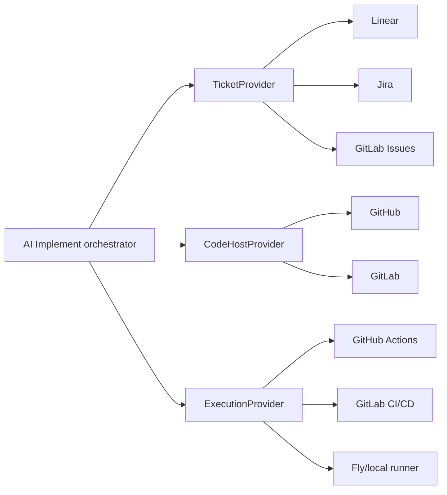

# GitLab-native support for AI Implement

Date: 2026-08-16  
Status: research, not an implementation plan

## Executive answer

A fully GitLab-native AI Implement is feasible, but it is not a provider plug-in of the same size as adding another ticket system. GitLab Issues fits the ticket-provider boundary that already exists. GitLab repositories, CI/CD, merge requests, authentication, webhooks, and onboarding require a new code-host boundary because those concerns are currently GitHub-shaped throughout the orchestrator and runner.

The right product architecture has two independent provider axes:

1. **Ticket provider:** Linear, Jira, or GitLab Issues.
2. **Code host:** GitHub or GitLab.

That distinction supports the prospective client's GitLab + GitLab configuration without preventing useful future combinations such as Jira + GitLab. It also keeps instance-specific GitLab concerns—GitLab.com versus self-managed, host URL, project ID, version, licensing tier, and network reachability—out of the generic ticket model.

For CI/CD packaging, the preferred GitLab-native equivalent of the synchronized GitHub Actions workflows is a versioned GitLab CI/CD component that a project includes from `.gitlab-ci.yml`. GitLab components are reusable, versioned pipeline units with typed inputs; they became generally available in GitLab 17.0. Pipeline inputs sent through the API became generally available in GitLab 18.1, so older supported self-managed versions would need CI/CD variables or a higher minimum supported version. [GitLab CI/CD components](https://docs.gitlab.com/ci/components/) [CI/CD inputs](https://docs.gitlab.com/ci/inputs/) [Pipelines API](https://docs.gitlab.com/api/pipelines/)

The likely delivery is **15–25 substantial tracer-bullet tickets across four workstreams**, not a small adapter. That is an engineering sizing judgment based on the repository impact described below, not a calendar commitment. A narrower client launch can be materially smaller if it targets one known GitLab deployment, one project layout, one authentication method, and the exact issue hierarchy and approval behavior the client uses.

## What “totally GitLab native” should mean

The client should be able to:

- connect a GitLab.com or supported self-managed GitLab instance;
- choose GitLab projects without entering GitHub owner/repository coordinates;
- use GitLab Issues as the AI Implement work queue, including comments, labels/status, blockers, and the hierarchy needed by the product;
- trigger and monitor work through GitLab pipelines executed by GitLab runners;
- clone, branch, commit, and push against the GitLab repository;
- create, update, review, approve, auto-merge, and observe GitLab merge requests;
- invoke or interact with AI Implement from GitLab notes and receive status there;
- use GitLab project webhooks for issue, note, merge-request, push, and pipeline events;
- store or pull the runner image through a GitLab-compatible container registry; and
- complete onboarding without GitHub App credentials, GitHub Actions secrets, or `.github/workflows` files.

GitLab provides APIs for all of those major primitives: issues, issue links, notes, merge requests, approvals, pipelines, project webhooks, repository files, labels, OAuth, and multiple access-token types. [Issues API](https://docs.gitlab.com/api/issues/) [Issue links API](https://docs.gitlab.com/api/issue_links/) [Notes API](https://docs.gitlab.com/api/notes/) [Merge requests API](https://docs.gitlab.com/api/merge_requests/) [Merge request approvals API](https://docs.gitlab.com/api/merge_request_approvals/) [Pipelines API](https://docs.gitlab.com/api/pipelines/) [Project webhooks API](https://docs.gitlab.com/api/project_webhooks/)

## Current product seams and GitHub coupling

### Ticketing is already a provider concept

`TicketingProvider` already abstracts issue lookup, comments, planning context, lifecycle transitions, blockers, hierarchy, issue URLs, and feature roll-ups. Provider identifiers are open-ended strings even though the registry and configuration currently implement only Linear and Jira. This makes GitLab Issues a bounded new provider rather than a rewrite. See [`src/providers/types.ts`](../../src/providers/types.ts), [`src/providers/registry.ts`](../../src/providers/registry.ts), and [`src/providers/ticketing-config.ts`](../../src/providers/ticketing-config.ts).

The GitLab adapter would need to decide how AI Implement lifecycle state is represented. GitLab's core issue state is open or closed, while labels can be added and removed through the issue API. The closest parity with today's product is therefore labels such as `AI Planning`, `AI Working`, `Plan Complete`, and `Ready for Review`, unless the client's GitLab version and configuration make Work Item custom statuses a better contract. [Issues API](https://docs.gitlab.com/api/issues/) [Labels API](https://docs.gitlab.com/api/labels/)

GitLab exposes issue relationships including `relates_to`, `blocks`, and `is_blocked_by`. Hierarchy is available through Work Item parent/child relationships, but the applicable Work Item and epic APIs, tier entitlements, and version behavior must be validated against the client's deployment. [Issue links API](https://docs.gitlab.com/api/issue_links/) [Work Item child items](https://docs.gitlab.com/user/work_items/child_items/) [Work Item linked items](https://docs.gitlab.com/user/work_items/linked_items/) [Epic Work Item API migration guide](https://docs.gitlab.com/api/graphql/epic_work_items_api_migration_guide/)

### Repository execution is not yet a provider concept

The current code treats GitHub as infrastructure, not as one code-host implementation:

- startup requires GitHub App credentials in [`src/index.ts`](../../src/index.ts);
- execution modes are named `github-actions` and `fly-machines` in [`src/config.ts`](../../src/config.ts);
- pipeline state contains `githubOwner`, `githubRepo`, `githubToken`, and `prNumber` in [`src/pipeline/types.ts`](../../src/pipeline/types.ts);
- autonomous execution requires `GITHUB_OWNER`, `GITHUB_REPO`, and `GITHUB_TOKEN` in [`src/run-autonomous.ts`](../../src/run-autonomous.ts);
- clone and push URLs are hard-coded to `github.com` in [`src/pipeline/steps/clone.ts`](../../src/pipeline/steps/clone.ts) and [`src/pipeline/steps/push.ts`](../../src/pipeline/steps/push.ts);
- workflow dispatch, workflow runs, pull requests, reviews, checks, comments, branches, reactions, comparisons, and merge operations live in [`src/github.ts`](../../src/github.ts);
- authentication is GitHub App installation-token authentication in [`src/github-app-auth.ts`](../../src/github-app-auth.ts);
- webhook verification and event dispatch expect GitHub headers and GitHub event shapes in [`src/webhook.ts`](../../src/webhook.ts);
- workflow synchronization writes GitHub workflow files in [`src/workflow-sync.ts`](../../src/workflow-sync.ts) and [`workflows/claude-implement.yml`](../../workflows/claude-implement.yml); and
- admin setup and UI expose GitHub repository coordinates, GitHub App installation, and GitHub execution choices in [`src/admin.ts`](../../src/admin.ts) and [`src/admin-ui`](../../src/admin-ui).

Internal persistence and orchestration also use pull-request vocabulary (`pr_url`, `pr_number`) in logging, reconciliation, review-ledger, and fix/gap-fill queues. Those fields can remain as compatibility aliases during migration, but the durable domain should use code-host-neutral terms such as `changeRequest`, `changeRequestNumber`, and `changeRequestUrl`.

## Recommended target architecture

The three boundaries answer different questions:

- `TicketProvider`: where work is described, related, blocked, and moved through the AI lifecycle;
- `CodeHostProvider`: where Git repositories and proposed changes live, and how comments, reviews, checks, branches, webhooks, and merge state work; and
- `ExecutionProvider`: where an AI Implement job is dispatched, monitored, cancelled, and supplied with credentials and inputs.

For GitHub, code host and execution often pair as GitHub + GitHub Actions. For GitLab, they often pair as GitLab + GitLab CI/CD. Keeping them distinct preserves the existing Fly/local path and avoids assuming that every GitLab repository must execute on a GitLab runner.

A repository mapping should move from GitHub `owner`/`repo` identity to a neutral identity that includes at least:

- `codeHostProvider`;
- `instanceUrl` and `apiUrl` where applicable;
- stable project/repository ID;
- human-readable project path, including nested groups;
- default branch;
- execution provider and workflow/component reference; and
- independent ticket-provider configuration.

Using the GitLab numeric project ID as the stable key avoids ambiguity when projects move between groups; path remains necessary for display and Git URLs. GitLab's project APIs accept a numeric ID or URL-encoded project path. [Projects API](https://docs.gitlab.com/api/projects/)

## Workstream 1: GitLab Issues provider

Implement a `GitLabTicketingProvider` behind the existing interface:

1. Fetch a project issue by IID and map title, description, labels, assignees, state, URL, and timestamps.
2. Add notes and fetch planning context from issue notes.
3. Implement lifecycle transitions through an agreed label or status convention.
4. Map `blocks` and `is_blocked_by` issue links to dependency checks.
5. Map the client's chosen Work Item hierarchy to feature/plan/implementation relationships and roll-ups.
6. Add GitLab provider configuration, registry construction, cache behavior, admin validation, and UI choices.
7. Make issue keys unambiguous across instances and projects, for example an internal composite of instance, project ID, and IID.

The issue API uses a project-scoped IID, so an IID alone is not globally unique. [Issues API](https://docs.gitlab.com/api/issues/)

The client-launch definition should explicitly name which hierarchy is required. “GitLab Issues” by itself does not establish whether they use epics, issues, tasks, custom Work Item types, or cross-project relationships.

## Workstream 2: GitLab code-host provider

Extract a code-host-neutral interface from the operations currently concentrated in `src/github.ts` and its callers. Required GitLab capabilities include:

- clone URL and authenticated remote construction;
- branch lookup, comparison, creation, and deletion;
- merge-request find/create/update/list/merge and merged-state lookup;
- notes, discussions, reactions or acknowledgements;
- approval state and review-state interpretation;
- pipeline/check state associated with a merge request;
- repository-file reads/writes used during project bootstrap;
- webhook verification, parsing, delivery deduplication, and neutral domain events; and
- credential acquisition and refresh.

GitLab's Merge Requests API covers creation, update, listing, merge, pipeline association, and merge status; approvals are a separate API. Notes and threaded discussions should be treated deliberately because AI Implement commands and review conversations may need different semantics. [Merge requests API](https://docs.gitlab.com/api/merge_requests/) [Merge request approvals API](https://docs.gitlab.com/api/merge_request_approvals/) [Notes API](https://docs.gitlab.com/api/notes/) [Discussions API](https://docs.gitlab.com/api/discussions/)

Webhook ingestion should normalize GitLab merge-request, note, pipeline, push, and issue events into the same internal events used by GitHub. GitLab project webhooks use a configured secret token delivered in the `X-Gitlab-Token` header; endpoint code must not reuse GitHub HMAC assumptions. [Project webhooks API](https://docs.gitlab.com/api/project_webhooks/) [Webhook events](https://docs.gitlab.com/user/project/integrations/webhook_events/)

## Workstream 3: GitLab CI/CD execution

Build a GitLab execution provider whose contract is parallel to GitHub Actions dispatch:

1. Publish the AI Implement runtime image to a registry the client's runners can pull from, preferably their GitLab Container Registry or an explicitly allowed registry.
2. Publish a versioned GitLab CI/CD component with typed inputs for mode, issue identity, run configuration, branch, callback identity, and any non-secret execution options.
3. Add a minimal `.gitlab-ci.yml` include to each onboarded project, ideally through a bootstrap merge request rather than a silent default-branch write.
4. Trigger pipelines through the Pipelines API, pass inputs or variables according to the supported GitLab version, and persist the returned pipeline ID.
5. Monitor job/pipeline state, cancellation, retry, trace URLs, and terminal callbacks.
6. Make the job report the resulting branch and merge-request identity to the orchestrator, or let the orchestrator create the merge request after the branch is pushed.

GitLab runners execute jobs defined in `.gitlab-ci.yml`, and executor choice determines the job environment. Docker execution can use an image declared in CI configuration. [GitLab Runner](https://docs.gitlab.com/runner/) [Runners](https://docs.gitlab.com/ci/runners/) [Executors](https://docs.gitlab.com/runner/executors/) [Using Docker images](https://docs.gitlab.com/ci/docker/using_docker_images/)

The most important credential design question is what the job is allowed to do. `CI_JOB_TOKEN` can authenticate repository access and selected APIs, but its permissions and allowlist are deliberately constrained. Git push with a job token requires a project setting, and job-token behavior should be validated on the client's version before it becomes the only branch-push strategy. [CI job token](https://docs.gitlab.com/ci/jobs/ci_job_token/) [Predefined CI/CD variables](https://docs.gitlab.com/ci/variables/predefined_variables/)

Three viable models should be compared in a spike:

1. **Job-token model:** the job pushes the branch with `CI_JOB_TOKEN`; the orchestrator creates the merge request through its GitLab credential.
2. **Delegated access-token model:** the orchestrator vends a short-lived or tightly scoped token to the job for branch and merge-request operations.
3. **Push-option model:** the job pushes and asks GitLab to create a merge request through Git push options, reducing API use inside the runner.

The first model gives the cleanest separation if the client's GitLab version and project settings support it. The second offers broader compatibility but expands secret-handling responsibility. The third is GitLab-native but provides less control over the complete merge-request lifecycle. [Git push options](https://docs.gitlab.com/topics/git/commit/#push-options)

## Workstream 4: identity, onboarding, deployment, and operations

### Authentication

The product should support an intentional credential model rather than treating a personal access token as the architecture:

- OAuth application and refresh tokens for a multi-tenant GitLab.com-style product;
- group or project access tokens for a client-owned installation where that operational model is acceptable; or
- a dedicated service account as a compatibility fallback.

GitLab REST supports OAuth, personal, project, group, and job tokens, but token availability, scope, lifetime, rotation, and licensing differ. OAuth access tokens expire and can be refreshed. Project and group access-token availability differs between GitLab.com tiers and self-managed installations. [REST API authentication](https://docs.gitlab.com/api/rest/authentication/) [Token overview](https://docs.gitlab.com/security/tokens/) [OAuth provider](https://docs.gitlab.com/integration/oauth_provider/) [Group access tokens](https://docs.gitlab.com/user/group/settings/group_access_tokens/) [Project access tokens](https://docs.gitlab.com/user/project/settings/project_access_tokens/)

### Admin onboarding

The GitLab path needs first-class setup screens and validation for:

- GitLab.com or self-managed instance URL;
- authentication connection and required scopes;
- group/project discovery and selection;
- project ID/path and default branch;
- ticket-provider choice and issue hierarchy convention;
- webhook creation and verification;
- CI component/include installation;
- protected branch and merge-request approval behavior;
- runner availability, tags, executor, and allowed container registry;
- CI/CD variables and secrets;
- job-token repository push setting; and
- end-to-end readiness check by dispatching a harmless validation pipeline.

### Self-managed support

“Self-managed GitLab” is a compatibility program, not one checkbox. The product must record or discover the GitLab version, support custom base/API URLs, handle trusted custom certificate authorities, and be deployable where the orchestrator can reach private GitLab and GitLab can reach its webhook endpoint. GitLab exposes version metadata through its Metadata API. [Metadata API](https://docs.gitlab.com/api/metadata/)

A support policy should state:

- minimum GitLab version;
- supported licenses/tiers for hierarchy and access-token features;
- supported runner executors;
- whether air-gapped or outbound-restricted installations are supported;
- container-registry and model-provider network requirements; and
- upgrade/deprecation policy for GitLab APIs.

## Suggested delivery sequence

### Phase 0: client compatibility dossier and spikes

- Capture deployment type, version, tier, network topology, runner executor, project layout, issue hierarchy, protected-branch rules, approval rules, and token policy.
- Prove API access and webhooks against a disposable project on their class of GitLab deployment.
- Spike `CI_JOB_TOKEN` branch push plus orchestrator-created merge request.
- Prove the CI component on the client's runner executor and registry.
- Produce a capability matrix with explicit supported and unsupported behaviors.

Stop condition: the team can run a harmless pipeline, push a branch, create an MR, receive webhook events, and update an issue using the proposed production credential model.

### Phase 1: narrow end-to-end client launch

- One GitLab deployment type and minimum version.
- One authentication model.
- GitLab Issues lifecycle labels, comments, blockers, and only the hierarchy the client actually uses.
- GitLab code-host operations necessary for one implementation flow.
- One CI component and supported runner executor.
- MR creation, pipeline status, notes, approvals needed by the client, and merged reconciliation.
- Client-specific onboarding and operational runbook.

Stop condition: a production-like issue can travel from planning through a merged GitLab MR with no GitHub or Linear dependency.

### Phase 2: productized GitLab support

- OAuth-based tenant onboarding and project discovery.
- GitLab.com and a declared self-managed version matrix.
- richer Work Item types/hierarchies and cross-project cases;
- multiple runner executors and registry topologies;
- complete webhook/retry/deduplication behavior;
- token rotation, revocation, observability, reconciliation, and recovery tooling;
- neutral terminology and data migration for existing PR/GitHub fields; and
- GitLab-specific documentation, support diagnostics, and automated compatibility suites.

Stop condition: a new supported GitLab customer can self-onboard without repository-specific code changes or operator database edits.

## Estimated implementation shape

The following is a sizing model, not a ticket plan:

| Workstream | Likely tracer bullets | Why |
| --- | ---: | --- |
| Neutral code-host domain and GitHub adapter extraction | 3–5 | Introduce interfaces and neutral events without regressing GitHub |
| GitLab Issues provider | 3–4 | Core CRUD is direct; lifecycle, hierarchy, and roll-ups carry product semantics |
| GitLab merge-request/repository/webhook adapter | 4–6 | Many GitHub operations have separate GitLab endpoints and event shapes |
| GitLab CI component and execution provider | 3–5 | Packaging, dispatch, monitoring, credentials, callbacks, runner compatibility |
| Authentication, admin onboarding, and self-managed operations | 3–5 | Connection lifecycle, scopes, project selection, webhooks, readiness, version/network support |
| **Total** | **16–25** | Some bullets can merge for a single-client launch; product parity tends toward the upper end |

An implementation plan should prefer vertical slices over finishing each abstraction horizontally. The first useful slice is: one GitLab issue triggers one GitLab pipeline, which pushes one branch, opens one merge request, comments back on the issue, and reconciles after merge. Subsequent slices add planning, hierarchy/roll-up, review feedback, grouped work, retries, and broader deployment compatibility.

## Principal risks and decisions

1. **Client deployment unknowns.** GitLab.com versus self-managed, version, tier, runner type, and network topology can materially change the implementation.
2. **Runner credentials.** Branch push and MR creation must work without placing a broad, long-lived credential in untrusted job scope.
3. **Issue hierarchy semantics.** The product must map the client's actual Work Item/epic/task structure rather than assume GitLab issues behave like Linear projects or Jira epics.
4. **Protected branches and approvals.** Automation must respect the client's approval, CODEOWNERS, pipeline, and merge policies; “mergeable” is not equivalent to “permitted to merge now.”
5. **API/version compatibility.** Pipeline inputs, components, Work Items, and token capabilities have evolved across GitLab releases.
6. **Dual-host regression risk.** Extracting GitHub behind a new interface touches core orchestration; contract tests must prove GitHub behavior remains intact.
7. **Private-instance connectivity.** SaaS-hosted AI Implement may not be able to reach an intranet GitLab, and GitLab may not be able to deliver webhooks to it.
8. **Terminology and persistence migration.** PR-named fields and GitHub-named run data should not become permanent leakage into the GitLab implementation.

## Questions to answer with the prospective client

These answers determine the phase-1 scope:

1. GitLab.com, GitLab Dedicated, or self-managed? Exact version and license tier?
2. Can AI Implement be hosted inside their network, or can their GitLab and runners reach the existing service and model providers?
3. Which runner executors and tags do they use? Can jobs pull an AI Implement container image?
4. Are CI/CD components and external project includes allowed? Is there an internal component catalog?
5. Which authentication forms are permitted for a service integration? OAuth application, group/project token, service account, or another broker?
6. May `CI_JOB_TOKEN` push to repositories, and may an orchestrator credential create merge requests?
7. How do they represent initiatives/features/work items/tasks, hierarchy, and blocking dependencies?
8. Which AI Implement lifecycle labels or custom statuses are acceptable?
9. What protected-branch, CODEOWNERS, approval, security scan, and merge-train rules apply?
10. Do issues and repositories always live in the same project? Are cross-project issues or forks part of the workflow?
11. Must the solution be air-gapped, use a private container registry, or trust an internal certificate authority?
12. What would constitute a successful pilot: planning only, one implementation flow, grouped features, review-fix loops, or full parity?

## Recommendation

Treat this as a strategic code-host expansion with a deliberately narrow first client slice:

1. Obtain the compatibility dossier above before estimating delivery dates.
2. Establish `CodeHostProvider` and `ExecutionProvider` contracts while preserving the existing `TicketingProvider` seam.
3. Prove the credential and CI component design on the same GitLab deployment class the client uses.
4. Build the first vertical GitLab-native issue-to-merged-MR flow.
5. Add only the client's required hierarchy, approvals, and runner variants for the pilot.
6. Productize GitLab.com/self-managed breadth after the end-to-end flow is stable.

The go/no-go question is therefore not basic GitLab API feasibility. It is whether AI Implement wants to own a second code-host integration as a durable product surface, including version compatibility, token operations, self-managed networking, and ongoing parity testing. For a genuinely interested client, the architecture supports it; the next responsible step is a client-specific compatibility session followed by a reviewed implementation plan.
