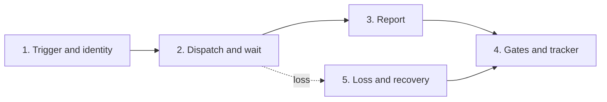

# Run lifecycle

What happens to one AI-Implement run from trigger to terminal state, which module implements each step today, and which seams a new run kind must touch. This is the reference for the lifecycle glue around the pipeline: the poll loop, the dispatch functions, the callback handler, the monitors, the reaper, the stuck watchdog, and the deploy hold. The pipeline inside the runner is documented in [pipeline-architecture.md](pipeline-architecture.md). The credentials that cross the boundary are documented in [runner-callbacks.md](runner-callbacks.md).

Status: this page describes the code on `testing` as of 2026-09-08. The run-kind contract that would replace the per-kind seams is proposed in [run-kind-contract.md](run-kind-contract.md).

## The five steps

| Step | What it means | Modules today |
|---|---|---|
| 1. Trigger and identity | A label, a status field, a comment, or a rail call names an issue and a kind. The identity is issue plus kind plus attempt. Duplicates are refused. | Poll loop in `src/index.ts` (60 s); per-team capacity in `src/poll-selection.ts`; dedup table in `src/dedup.ts` (no TTL); comment trigger in `src/webhook.ts` and `src/comment-gapfill-drain.ts`; kg-refresh trigger in `src/kg-refresh.ts` |
| 2. Dispatch and wait | One backend starts a runner with the envelope. The orchestrator then waits for the report, with a heartbeat and a deadline. | `dispatchGitHubActions`, `dispatchPlanning`, `dispatchSession`, `dispatchFlyMachine`, `dispatchLocalDocker`, `dispatchKgRefreshRun` in `src/index.ts`; envelope `RunConfigV1` in `src/run-config.ts`; jobs row in `src/log.ts`; run tokens in `src/runner-tokens.ts`; GHA and Fly monitors in `src/index.ts` |
| 3. Report | The runner posts its terminal result once: outcome, PR URL, summary, and the approval mark. Progress posts stream step state during the run. | `postRunnerResult` in `src/runner-result.ts`; `/runner/result` and `/runner/progress` in `src/runner-callback.ts`, with one branch per phase: `planning`, `implementation`, `gap-analysis`, `kg-refresh`; `step_log` in `src/step-log.ts` |
| 4. Gates and tracker | Review verdict, approval mark, merge, cascade to a parent, tracker transition. | `markPlanComplete`, `markPrReady`, `markImplementationFailed` through `src/providers/`; the approval mark in `src/log.ts` (`runner_approved`, ADR 014); `src/auto-merge.ts`; `src/feature-branch.ts` and `src/merge-up.ts`; `src/reconciliation.ts` and `src/poll-merged-prs.ts`; `src/review-fix-queue.ts` |
| 5. Loss and recovery | No heartbeat, runner gone, or a restart under the run: recover, retry, or give up with a reason, and tell the tracker. | `src/reaper.ts` (machine and GHA reconciliation, including the kg-refresh rule); `src/stuck-watchdog.ts`; `src/deploy-hold.ts`; `src/completion-classification.ts` and `src/run-autopsy.ts` |

## Six loops read the same run

The run's state is not in one place. Each loop below infers it from a different signal, and each writes a different column.

| Loop | Reads | Writes |
|---|---|---|
| Poll loop | Tracker labels or status field, dedup table, in-flight rows | `dispatched`, `dispatch_log` |
| GHA monitor | Workflow run status | `status`, `conclusion` from the workflow result |
| Fly monitor | Machine state | `status`, `conclusion` from the machine result |
| Callback handler | The runner's report | `pr_url`, `conclusion = runner_approved`, tracker transitions |
| Reaper | Machine registry, workflow run, row age | Closes rows, fails chains |
| Stuck watchdog and deploy hold | Row age, in-flight set | Requeue, give up, pause dispatch |

The monitors write the execution-layer conclusion. The callback writes the runner's conclusion. The `CASE` guard in `updateJobStatus` (`src/log.ts`) keeps `operator_cancelled` and `runner_approved` from being overwritten by a later monitor write. When the report does not arrive, every other loop still sees a healthy run. That is the shape of the AII-567 incident.

## What a new run kind touches today

Adding `kg-refresh` (AII-521, AII-555) touched these seams. A new kind touches the same list until the run-kind contract exists.

- A dispatch function in `src/index.ts`, or a branch in an existing one.
- A `runnerPhase` value in `src/run-config.ts` and a phase branch in `src/runner-callback.ts`.
- A pipeline YAML under `pipelines/` and its `applyWiring` cases in `src/pipeline/pipeline-loader.ts`.
- A monitor path, or a reason the existing one applies.
- A reaper rule in `src/reaper.ts` when the kind can lose its runner in a new way.
- The deploy hold in `src/deploy-hold.ts`, so a deploy does not restart the machine under the run.
- Admin visibility: the pipelines page and the MCP tools read `dispatch_log` by phase.
- A credential path in `src/runner-tokens.ts` and a vending endpoint when the kind needs a new scope.

## Checklist: before you add a run kind

1. Read [run-kind-contract.md](run-kind-contract.md). If the contract has landed, register the kind there and stop.
2. Otherwise list every seam above with the file and line you will change. A seam you cannot name is a seam you will miss.
3. Write the tracker effect of each terminal outcome before writing the callback branch.
4. Add the reaper rule and the deploy-hold case in the same change as the dispatch function.
5. Add a test that starts the kind, reports, and reaches the terminal state without a live backend.
6. Update this page and `docs/issueless-runs.md` or `docs/feature-branch-grouping.md`, whichever the kind belongs to, in the same PR.
