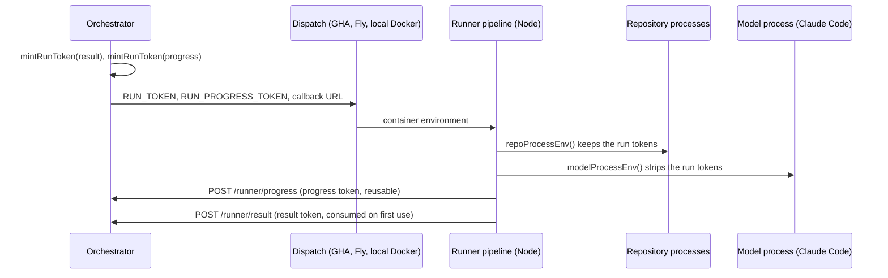

# Runner callbacks and run tokens

How a dispatched run reports back to the orchestrator, which credentials carry that authority, which processes inside the runner can see them, and what one misuse destroys.

This is the reference for `src/runner-tokens.ts`, `src/runner-callback.ts`, `src/runner-result.ts`, the `src/*-token-vending.ts` modules, and `src/pipeline/process-env.ts`. `CLAUDE.md` links here from the "Runner callbacks and tokens" row.

The blast-radius section exists because of AII-567: a test suite inside a dispatched runner posted to the live orchestrator and burned every run's result token for three days. The learning record is [docs/solutions/workflow-patterns/runner-test-suite-burned-the-run-token.md](solutions/workflow-patterns/runner-test-suite-burned-the-run-token.md). This page records the structure that made it possible, so the next change to this path starts from the census below.

## The path

## Credentials

| Name | Audience | Minted | Carried by | Read by | Verified by | Consumed |
|---|---|---|---|---|---|---|
| `RUN_TOKEN` | `result` | `mintRunToken` at dispatch (`src/runner-tokens.ts`) | GHA: `inputs.run_token` into the step env in `workflows/claude-implement.yml`, `claude-plan.yml`, `claude-kg-refresh.yml`. Fly: machine env in `buildSessionMachineConfig` (`src/fly-machines.ts`). Local: container env (`src/local-docker.ts`) | `postRunnerResult` (`src/runner-result.ts`) | `POST /runner/result` with `verifyRunToken(…, "result", { consume: true })` | Yes, on first use |
| `RUN_PROGRESS_TOKEN` | `progress` | `mintRunToken` at dispatch | Same three carriers | `src/run-autonomous.ts`, `src/run-planning.ts`, `src/pipeline/kg-refresh-run.ts`, `src/pipeline/steps/dependency-auth.ts`, `reference-repos.ts`, `kg-tracker-data.ts` | `POST /runner/progress`, `GET /runner/planning-context`, `POST /api/runner/dependency-token`, `reference-token`, `kg-push-token`, `kg-tracker-data`, all with `{ consume: false }` | No |
| `RUN_PUBLICATION_TOKEN` | `publication` | `mintRunToken` with a repository claim | Runner env | The push path exchanges it | `POST /api/runner/publication-token` with `{ consume: true }`; returns a repository write credential | Yes, on the exchange |
| `RUNNER_CALLBACK_URL` | none, an address | Envelope `runnerCallbackUrl` or a plain env var | Same carriers | `postRunnerResult` fallback and the progress posters | none | No |

A token is a signed claim set stored in the `runner_tokens` table with `dispatch_id`, `audience`, and `consumed_at`. `verifyRunToken` answers `already_consumed` when `consumed_at` is set. The callback endpoints answer 501 when `RUNNER_TOKEN_SECRET` is unset.

## Process boundary inside the runner

| Process | Environment builder | Run tokens | Model credentials | Forwarded secrets | GitHub write tokens |
|---|---|---|---|---|---|
| The pipeline itself (Node) | `process.env` | present | present | present | present |
| Repository processes: `install`, `setup`, `verify`, `teardown` hooks, and `preflight`, which runs the repository's `typecheck`, `lint`, and `test` scripts | `repoProcessEnv()` | **present** | stripped | present | present |
| The model process and everything it spawns | `modelProcessEnv()` | stripped (`RUNNER_CREDENTIAL_KEYS`, since AII-396 on 2026-09-02) | one of the two | stripped | stripped unless a gap-fill owns its branch |

The consequence to remember: any code the repository runs under `preflight` or a hook holds the run's own authority. A test suite is repository code. The model process cannot reach the tokens, so "the agent did it" is the wrong model of this failure.

## Blast radius

What one stray use of each credential destroys, and where the symptom appears.

| Credential | One stray use | What is lost | Where the symptom appears | Recovery |
|---|---|---|---|---|
| Result token | One extra `POST /runner/result` before the real report | The real report is refused `409 already_consumed`: outcome, PR URL, implementation summary, and the approval mark (ADR 014). On GitHub Actions the tracker transition too: the issue keeps `AI-Working`, holds its dispatch slot, and fills the per-team cap | In other subsystems: the merge gate holds the PR with "no approval mark"; a fix that stamps the mark has nothing to stamp; the cap shows finished runs as in progress; `get_issue_dispatch_status` reads `conclusion: success` with `mergeVerdict: hold` | None for that run. A person merges by hand and clears the labels. Observed 2026-09-04 to 2026-09-07 (AII-567), about three days of build-down |
| Progress token | A stray progress post or token exchange | Nothing is burned; the token is reusable. A stray exchange mints a dependency or reference token for the run's team, which reads every repository the App installation covers | `step_log` rows that do not match a real step; unexplained token rows | Tokens expire; nothing to repair |
| Publication token | One stray exchange | The real push has no write credential and the run cannot open its PR | The push step fails | Re-dispatch. Inferred from `{ consume: true }`; not observed |
| Callback URL with a token | A test that reaches the live orchestrator | Whatever the token allows, above | See the result-token row | See above |

## Rules

1. A test that touches a runner entry point (`runKgRefresh`, `runAutonomous`, `postRunnerResult`) runs disarmed: `RUN_TOKEN`, `RUNNER_CALLBACK_URL`, and `RUN_PROGRESS_TOKEN` are cleared. The file-level hook from PR #467 does this for one file. AII-588 moves it to a vitest setup file so every suite starts disarmed.
2. A test that arms on purpose points at an unroutable host and injects `fetchImpl`.
3. Verification of this rule is a listener that counts `POST /runner/result` during a run. The expected count is zero. A green suite is not evidence.
4. Do not add a runner-side "am I in a test" branch. It was rejected in PR #467: a test-only branch in production code, and the throwing variant lands in the same `catch` that posts again.
5. A change to this path updates this page in the same change. Run the census first.

## The census: before you change this path

Walk every row and cite the line.

- Producers: every `mintRunToken` call site, one per dispatch path and per audience.
- Carriers: the three workflow templates, `buildSessionMachineConfig`, `src/local-docker.ts`, and the envelope's `runnerCallbackUrl`.
- Readers: the modules in the Credentials table, plus any new step that calls a vending endpoint.
- Verifiers: every `verifyRunToken` call site, with its audience and its `consume` flag.
- Strippers: `RUNNER_CREDENTIAL_KEYS` in `src/pipeline/process-env.ts`, and which builder each spawned process uses.
- Tests: the setup file that disarms, and the tests that assert a stray post is refused.

## Related

- AII-567 and PR #467: the incident and the one-file fix. AII-588: the suite-wide disarm.
- AII-580: the mask step echoed both tokens into the job log before masking them. Fixed in the three templates.
- AII-318 and AII-319: the planned OIDC bootstrap that stops dispatching live tokens as workflow inputs. Not landed.
- ADR 009: model credential exposure, the precedent for the process-boundary split.
- A design that makes the terminal report an idempotent fact keyed by dispatch id exists in the planning documents. It is not scheduled.
