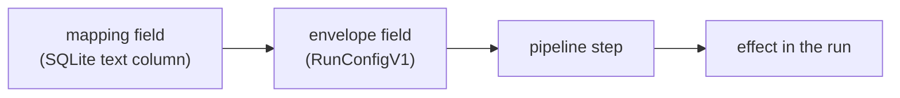

# Runner context

Per-project settings whose job is to give a run something it would not otherwise have.

A run starts with one repository and one credential scoped to it. Each setting on this page widens that in a specific direction, and each is off by default. This page covers what each one gives a run, how it reaches the runner, which run phases apply it, and what enabling it costs.

`CLAUDE.md` carries the summary and points here. The mechanics these settings sit on top of belong to other references: `docs/pipeline-architecture.md` for the step contract, how steps get their inputs, and fork overrides; `docs/workflow-envelope.md` for the envelope itself.

## What makes a setting a runner-context setting

Four stages, in this order:

An operator sets the field at `/admin` on the project's **Context** tab. It persists on the `mappings` row, rides the dispatch envelope, is read onto the pipeline context by the runner's entry module, and is consumed by a step that skips itself when the value is absent.

Every setting in this category shares four properties:

- **Optional, and off by default.** A blank field is the normal state.
- **Skipped rather than defaulted.** The consuming step declares a `skip` predicate on the absent value, so nothing runs and nothing is substituted.
- **Non-fatal.** A misconfigured value costs the run that capability and nothing else. No setting here can fail a run by being wrong.
- **Phase-dependent.** Whether a setting is applied is decided by the run's phase, not by the mapping.

The last two combine into the property worth internalizing: **a green pipeline is not evidence that a setting took effect.** The step's own log line is the only signal.

Each setting below is documented in the same shape — what it gives a run, the field, how it reaches the runner, what the step does, and what enabling it costs.

## Which phases apply a setting

`session/entrypoint.sh` maps `RUNNER_PHASE` to an entry module, and the entry module decides which pipeline runs, or whether there is one at all. A setting is applied only when the phase's pipeline contains its step *and* the entry module reads the field onto the context.

| Setting | `implementation` | `gap-analysis` | `planning` | `kg-refresh` |
|---------|------------------|----------------|------------|--------------|
| Skills repository | applied | applied | ignored | ignored |
| Dependency token scope | applied | applied | not sent | applied |
| Reference repositories | applied | applied | not sent | not sent |

Gap-analysis shares the implementation entry module — it is an implementation run with `prNumber` set — so the two columns will agree for any setting added here.

**Planning applies nothing on this page.** `run-planning.js` invokes Claude directly and runs no pipeline, so there is no step to consume anything. The settings reach that boundary differently: dependency token scope and reference repositories are both guarded out of the planning envelope at dispatch, while a skills repository is encoded into it and then never read. Treat neither as a bug to fix in passing — giving planning access to pipeline-provided capabilities is tracked work with a wider scope than dropping a field.

**kg-refresh runs its own pipeline** (`pipelines/kg-refresh.yml`), which includes `dependency-auth` but neither `install-skills` nor `reference-repos`. Reference repositories are additionally guarded out of its envelope, so that phase never receives the field at all. Its dependency token is not optional in the way the table suggests: a later step depends on it, and `docs/issueless-runs.md` §5 covers that rail.

## Skills repository

**What it gives a run.** Skills from another repository, installed where the coding CLI discovers them, so the agent can invoke workflows the target repository does not define. This changes the agent's *capability*.

**The field.** `skillsRepo`, column `skills_repo`, null means none. It accepts `owner/repo` shorthand or a full `https://github.com/...` URL. `normalizeGitHubRepo` validates it when the mapping is saved and rejects four things:

- any host other than an exact, case-insensitive `github.com` — `www.github.com` included, since git remotes live on the apex host
- SSH `git@` URLs, which would store as valid and then silently fail at clone time
- a URL embedding a username or token
- anything that does not parse as a URL or match the shorthand

The rejection of other hosts is not stylistic. The runner's only clone credential is a GitHub App token, and it must never be sent anywhere else.

**How it reaches the runner — three paths.** Envelope repositories receive `run_config.skillsRepo`. Legacy-contract repositories receive a `skills_repo` dispatch input, emitted only when the mapping sets one so unmigrated repositories keep dispatching. Fly Machines and local Docker receive `AI_IMPLEMENT_SKILLS_REPO` in the container environment.

**What the step does.** `install-skills` clones the repository shallow into a temporary directory, with a 60-second timeout and `GIT_TERMINAL_PROMPT=0` so a hung or credential-less remote fails fast instead of consuming the job timeout.

The credential is the clone step's output token rather than the token the container booted with. It is embedded in the remote URL only for a `github.com` host; a cross-host https remote is cloned with no credentials at all, so a public repository still works and a private one fails rather than leaking. Every string the step logs passes through a redactor that splits on the token, so a repeated occurrence cannot survive into a log line.

Discovery is deliberately shallow. Three roots are scanned exactly one level deep, and a directory counts as a skill only if `SKILL.md` sits directly inside it:

| Root | Convention |
|------|------------|
| `<repo>/<name>/SKILL.md` | flat layout |
| `<repo>/skills/<name>/SKILL.md` | Claude Code plugin layout |
| `<repo>/.claude/skills/<name>/SKILL.md` | project-scoped skills |

A repository may use more than one root, and the first root wins on a name collision. Arbitrary nesting is not scanned — that keeps the copy deterministic and avoids pulling `SKILL.md` files out of test fixtures or vendored dependencies.

Each skill directory is copied to `$HOME/.claude/skills/<name>` with `force: true`. An installed skill therefore **overwrites** a same-named skill already present in the image. The temporary clone is removed in a `finally` block.

**What enabling it costs.** One named repository, cloned read-only into a directory that is deleted when the step ends. The cost is the overwrite: a skills repository shipping a name the image already uses replaces it silently for that run.

**What omitting it costs.** The agent runs with only the skills baked into the image. A repository whose `WORKFLOW.md` instructs the agent to invoke a project-specific skill will produce a run that cannot follow its own instructions, and nothing reports that as an error.

## Dependency token scope

**What it gives a run.** A second GitHub token — installation-wide but strictly `contents: read` — mounted so a dependency install can resolve private sibling repositories. This changes the run's *permission*.

**The field.** `dependencyTokenScope`, column `dependency_token_scope`. The only accepted value is `"installation"`; null is off and is the default.

**How it reaches the runner — the envelope only.** There is no dispatch input and no environment variable. The runner's legacy-env branch hardcodes the value to `undefined`, so a repository still on the legacy workflow contract cannot receive this setting no matter what the mapping says.

**The two-token split** is what makes the feature safe to offer at all. The run's primary token carries the App's full grants but is narrowed to the target repository alone. The dependency token is the mirror image: installation-wide, but read-only on contents.

So the implementer can read the sibling repositories it needs, and can never push to any of them.

**Three preconditions, each logged separately when it fails.** The step needs the scope set on the context, a callback URL, and `RUN_PROGRESS_TOKEN` in the environment.

The third is the mechanical content of "requires a publicly reachable orchestrator": the token is fetched over the runner callback, so a run dispatched without a progress token skips the fetch and proceeds without private-dependency access rather than failing. It is also why planning could never use this setting even if the envelope carried it, since planning is dispatched with no progress token by design.

**Vending.** The step posts to `/api/runner/dependency-token` with the progress token as its bearer. The orchestrator verifies that token without consuming it — the progress audience is multi-use — then re-resolves the mapping from the token's team key and re-checks the scope there.

**The runner cannot ask for more than its mapping allows**, because the scope decision is made server-side from the mapping rather than from anything the caller sends. Every authentication and authorization failure returns an identical `403 {"error":"Unauthorized"}`, so a caller cannot enumerate which check it failed; the reason is logged server-side only.

The mint requests `contents: read` and passes **no repository list**. That omission is the entire scope story: the underlying helper sends a `repositories` body only when given one, so a request without it receives every repository in the installation. The mint also forces a refresh rather than accepting a cached token, because the credential helper refreshes purely on expiry and never on a 401 — a cache hit minutes from expiry would leave every later sibling clone failing for the rest of the run.

**Refresh.** The credential helper re-vends when ten minutes or fewer remain on the cached token. It writes the replacement to a temporary file in the same directory and moves it into place, because git spawns one helper process per credential request and a parallel fetch must never read a truncated cache. The helper exits 0 on every path including every failure, since returning no credentials is always preferable to aborting a git operation.

**The helper never sees the target repository's own traffic.** The clone and push steps build remote URLs that already carry a userinfo component, and git skips credential helpers entirely for such URLs. The global registration is therefore consulted only for unauthenticated `https://github.com` requests, which is exactly the private sibling clone a dependency installer triggers.

**What enabling it costs.** The token reads every repository the App installation covers, not a chosen subset. Enabling it for one private dependency grants read access to all of them.

A per-project repository list is the planned second version, and the field is stored as text so a JSON array slots in without a migration. Until then the scope is all-or-nothing, which is why the field defaults to off.

**What omitting it costs.** A dependency install that needs a private sibling repository fails at install time with an authentication error, not with a message naming this setting.

## Reference repositories

**What it gives a run.** Other repositories, cloned into the workspace and kept out of the implementation commit, so the agent can check a claim against real source instead of trusting what the issue asserts. This changes what the agent can *see*.

**The field.** `referenceRepos`, column `reference_repos`, stored as a JSON array; null means none. Each entry declares a `repo` (`owner/repo` shorthand or an `https://github.com/...` URL), a workspace-relative `path` to clone it into, and an optional `ref` — a branch, tag, or full commit hash, where absent means the default branch. The same repository may appear twice at two paths on two refs, since entries are keyed by path.

`normalizeReferenceRepos` validates entries when the mapping is saved, and the step validates each one again before using it. The second pass is deliberate: a value stored before a rule tightened is still in the database, and the clone is the moment a declared path becomes a filesystem operation. Entries are validated one at a time, so a single bad path records `path-invalid` and is skipped while its siblings proceed.

**How it reaches the runner — the envelope only.** There is no dispatch input and no environment variable. The runner's legacy-env branch hardcodes the value to `undefined`, so a repository still on the legacy workflow contract cannot receive this setting no matter what the mapping says.

**What the step does.** `reference-repos` runs immediately after `clone`, so everything later can assume the directories exist, and is skipped when the envelope declares no entries.

It first posts to `/api/runner/reference-token` with the run's progress token as its bearer. The orchestrator verifies that token without consuming it, re-reads the repository list from the mapping rather than from the request — a runner cannot name a repository the mapping never declared — and mints one token per distinct owner. Per owner rather than per entry, so two entries from the same organization cost one credential request.

**Each token is scoped to exactly the repositories declared for that owner**, not to everything the installation covers, and carries only `contents: read`. That narrowing is the point of the feature having its own vending endpoint: reusing the installation-wide dependency token was considered and rejected, because it would make an operator grant read across every repository the App can see in order to clone the one they named. An owner the App is not installed on returns no token at all and its public repositories still clone.

The clone takes one of two paths, and neither leaves the credential behind:

- **A full commit hash** — `git init`, then `git fetch --depth 1 <url> <sha>`, then a checkout of `FETCH_HEAD`. No origin remote is ever created.
- **A branch, tag, or the default branch** — `git clone --depth 1 [--branch <ref>]`, where the URL is a command argument rather than stored configuration.

Both pass the credential through `GIT_CONFIG_COUNT` / `GIT_CONFIG_KEY_0` / `GIT_CONFIG_VALUE_0`, which git reads for a single invocation and never writes to disk. A token embedded in the URL would survive in `remote.origin.url` for the whole run, in a directory the agent is pointed at — which is why this form is specified rather than left to the implementer.

After each clone the destination is appended to `.git/info/exclude`, so the directory cannot be staged by `git add -A` or swept into a commit by the push step.

**What it reports, and to whom.** The step returns one result per declared entry carrying the repository, the path, the resolved ref, whether it arrived, and — when it did not — one of five causes:

| Cause | What happened | What an operator can do |
|-------|---------------|-------------------------|
| `no-auth` | The repository is private and the App is not installed on that owner | Install the App on that organization |
| `ref-not-found` | The declared ref does not exist | Correct the `ref` in the mapping |
| `token-error` | The orchestrator could not mint a token for that owner | Check the orchestrator log for the mint failure |
| `clone-error` | A network or git error prevented the clone | Usually transient; re-dispatch |
| `path-invalid` | The declared path failed re-validation, or collides with another entry | Correct the `path` in the mapping |

Those results reach two readers. The implement step appends a `## Reference Repositories` section to the prompt at invocation time and on every feedback-loop iteration, naming each repository that arrived with its path, and naming each one that did not with its cause plus an instruction to assert nothing about it. The terminal callback carries the same results to the orchestrator, which comments on the ticket only when something is missing — a run where everything arrived says nothing, because a report nobody needs is noise on a surface where noise costs attention.

A missing repository never fails the run or changes its classification. That is the whole design: a silently absent source tree is the worst available outcome, because the agent falls back to transcribing the issue and the run looks identical to a successful one.

**What enabling it costs.** Exposure to whatever the declared repositories contain, for the length of the run. The credential itself is narrow — read-only, and limited to the repositories named — so this does not widen what a run can reach beyond what the operator chose. The reviewer is the gap worth knowing about: it works in the same workspace and can open the files, but it receives no reference-repositories section, so it is not told they are there.

**What omitting it costs.** The agent improvises from the target repository alone. For an issue that turns on how a sibling repository actually behaves, that produces confident output which may be wrong in exactly the way automated review cannot catch — since the reviewer has no more access to the truth than the implementer did.

## Gotchas

- **Dependency token scope is silently inert on a legacy-contract repository.** The setting saves, displays, and does nothing. The admin interface does not distinguish, so the only way to know is the target repository's workflow contract.
- **Reference repositories are also inert on legacy-contract repositories.** The field is envelope-only; no dispatch input and no environment variable carry it, so the step never receives entries on a legacy workflow.
- **A skills repository is encoded into every envelope, including phases that ignore it.** An envelope carrying `skillsRepo` proves nothing about whether the run will use it; the phase table above is what decides.
- **Both steps report success while doing nothing.** `install-skills` returns zero installed on every failure path, and `dependency-auth` returns `acquired: false`. Neither fails its step, so the `[skills]` and `[dependency-auth]` log lines are the only evidence a setting took effect.
- **A skills repository can overwrite a skill the image ships.** The copy is forced and keyed on directory name, with no warning on collision.
- **A missing reference repository does not fail the run.** The step records a cause and continues. The agent receives a prompt telling it the repository is unavailable; whether that makes the output wrong is the issue author's problem to anticipate, not the pipeline's to prevent.
