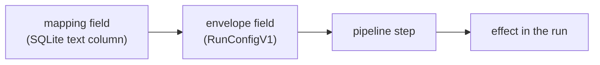

# Runner context

Per-project settings whose job is to give a run something it would not otherwise have.

A run starts with one repository and one credential scoped to it. Each setting on this page widens that in a specific direction, and each is off by default. This page covers what each one gives a run, how it reaches the runner, which run phases apply it, and what enabling it costs.

`CLAUDE.md` carries the summary and points here. The mechanics these settings sit on top of belong to other references: `docs/pipeline-architecture.md` for the step contract, how steps get their inputs, and fork overrides; `docs/workflow-envelope.md` for the envelope itself.

## What makes a setting a runner-context setting

Four stages, in this order:

An operator sets the field at `/admin` on the project's **Context** tab. It persists on the `mappings` row, rides the dispatch envelope, is read onto the pipeline context by the runner's entry module, and is consumed by a step that skips itself when the value is absent.

Every setting in this category shares four properties:

- **Optional, and off by default.** A blank field is the normal state.
- **Skipped rather than defaulted.** The consuming step declares a `skip` predicate on the absent value, so nothing runs and nothing is substituted.
- **Non-fatal.** A misconfigured value costs the run that capability and nothing else. No setting here can fail a run by being wrong.
- **Phase-dependent.** Whether a setting is applied is decided by the run's phase, not by the mapping.

The last two combine into the property worth internalizing: **a green pipeline is not evidence that a setting took effect.** The step's own log line is the only signal.

Each setting below is documented in the same shape — what it gives a run, the field, how it reaches the runner, what the step does, and what enabling it costs.

## Which phases apply a setting

`session/entrypoint.sh` maps `RUNNER_PHASE` to an entry module, and the entry module decides which pipeline runs, or whether there is one at all. A setting is applied only when the phase's pipeline contains its step *and* the entry module reads the field onto the context.

| Setting | `implementation` | `gap-analysis` | `planning` | `kg-refresh` |
|---------|------------------|----------------|------------|--------------|
| Skills repository | applied | applied | ignored | ignored |
| Dependency token scope | applied | applied | not sent | applied |
| Reference repositories | applied | applied | not sent | not applicable |

Gap-analysis shares the implementation entry module — it is an implementation run with `prNumber` set — so the two columns will agree for any setting added here.

**Planning applies nothing on this page.** `run-planning.js` invokes Claude directly and runs no pipeline, so there is no step to consume anything. The two settings reach that boundary differently: dependency token scope is guarded out of the planning envelope at dispatch, while a skills repository is encoded into it and then never read. Treat neither as a bug to fix in passing — giving planning access to pipeline-provided capabilities is tracked work with a wider scope than dropping a field.

**kg-refresh runs its own pipeline** (`pipelines/kg-refresh.yml`), which includes `dependency-auth` but not `install-skills`. Its dependency token is not optional in the way the table suggests: a later step depends on it, and `docs/issueless-runs.md` §5 covers that rail.

## Skills repository

**What it gives a run.** Skills from another repository, installed where the coding CLI discovers them, so the agent can invoke workflows the target repository does not define. This changes the agent's *capability*.

**The field.** `skillsRepo`, column `skills_repo`, null means none. It accepts `owner/repo` shorthand or a full `https://github.com/...` URL. `normalizeGitHubRepo` validates it when the mapping is saved and rejects four things:

- any host other than an exact, case-insensitive `github.com` — `www.github.com` included, since git remotes live on the apex host
- SSH `git@` URLs, which would store as valid and then silently fail at clone time
- a URL embedding a username or token
- anything that does not parse as a URL or match the shorthand

The rejection of other hosts is not stylistic. The runner's only clone credential is a GitHub App token, and it must never be sent anywhere else.

**How it reaches the runner — three paths.** Envelope repositories receive `run_config.skillsRepo`. Legacy-contract repositories receive a `skills_repo` dispatch input, emitted only when the mapping sets one so unmigrated repositories keep dispatching. Fly Machines and local Docker receive `AI_IMPLEMENT_SKILLS_REPO` in the container environment.

**What the step does.** `install-skills` clones the repository shallow into a temporary directory, with a 60-second timeout and `GIT_TERMINAL_PROMPT=0` so a hung or credential-less remote fails fast instead of consuming the job timeout.

The credential is the clone step's output token rather than the token the container booted with. It is embedded in the remote URL only for a `github.com` host; a cross-host https remote is cloned with no credentials at all, so a public repository still works and a private one fails rather than leaking. Every string the step logs passes through a redactor that splits on the token, so a repeated occurrence cannot survive into a log line.

Discovery is deliberately shallow. Three roots are scanned exactly one level deep, and a directory counts as a skill only if `SKILL.md` sits directly inside it:

| Root | Convention |
|------|------------|
| `<repo>/<name>/SKILL.md` | flat layout |
| `<repo>/skills/<name>/SKILL.md` | Claude Code plugin layout |
| `<repo>/.claude/skills/<name>/SKILL.md` | project-scoped skills |

A repository may use more than one root, and the first root wins on a name collision. Arbitrary nesting is not scanned — that keeps the copy deterministic and avoids pulling `SKILL.md` files out of test fixtures or vendored dependencies.

Each skill directory is copied to `$HOME/.claude/skills/<name>` with `force: true`. An installed skill therefore **overwrites** a same-named skill already present in the image. The temporary clone is removed in a `finally` block.

**What enabling it costs.** One named repository, cloned read-only into a directory that is deleted when the step ends. The cost is the overwrite: a skills repository shipping a name the image already uses replaces it silently for that run.

**What omitting it costs.** The agent runs with only the skills baked into the image. A repository whose `WORKFLOW.md` instructs the agent to invoke a project-specific skill will produce a run that cannot follow its own instructions, and nothing reports that as an error.

## Dependency token scope

**What it gives a run.** A second GitHub token — installation-wide but strictly `contents: read` — mounted so a dependency install can resolve private sibling repositories. This changes the run's *permission*.

**The field.** `dependencyTokenScope`, column `dependency_token_scope`. The only accepted value is `"installation"`; null is off and is the default.

**How it reaches the runner — the envelope only.** There is no dispatch input and no environment variable. The runner's legacy-env branch hardcodes the value to `undefined`, so a repository still on the legacy workflow contract cannot receive this setting no matter what the mapping says.

**The two-token split** is what makes the feature safe to offer at all. The run's primary token carries the App's full grants but is narrowed to the target repository alone. The dependency token is the mirror image: installation-wide, but read-only on contents.

So the implementer can read the sibling repositories it needs, and can never push to any of them.

**Three preconditions, each logged separately when it fails.** The step needs the scope set on the context, a callback URL, and `RUN_PROGRESS_TOKEN` in the environment.

The third is the mechanical content of "requires a publicly reachable orchestrator": the token is fetched over the runner callback, so a run dispatched without a progress token skips the fetch and proceeds without private-dependency access rather than failing. It is also why planning could never use this setting even if the envelope carried it, since planning is dispatched with no progress token by design.

**Vending.** The step posts to `/api/runner/dependency-token` with the progress token as its bearer. The orchestrator verifies that token without consuming it — the progress audience is multi-use — then re-resolves the mapping from the token's team key and re-checks the scope there.

**The runner cannot ask for more than its mapping allows**, because the scope decision is made server-side from the mapping rather than from anything the caller sends. Every authentication and authorization failure returns an identical `403 {"error":"Unauthorized"}`, so a caller cannot enumerate which check it failed; the reason is logged server-side only.

The mint requests `contents: read` and passes **no repository list**. That omission is the entire scope story: the underlying helper sends a `repositories` body only when given one, so a request without it receives every repository in the installation. The mint also forces a refresh rather than accepting a cached token, because the credential helper refreshes purely on expiry and never on a 401 — a cache hit minutes from expiry would leave every later sibling clone failing for the rest of the run.

**Refresh.** The credential helper re-vends when ten minutes or fewer remain on the cached token. It writes the replacement to a temporary file in the same directory and moves it into place, because git spawns one helper process per credential request and a parallel fetch must never read a truncated cache. The helper exits 0 on every path including every failure, since returning no credentials is always preferable to aborting a git operation.

**The helper never sees the target repository's own traffic.** The clone and push steps build remote URLs that already carry a userinfo component, and git skips credential helpers entirely for such URLs. The global registration is therefore consulted only for unauthenticated `https://github.com` requests, which is exactly the private sibling clone a dependency installer triggers.

**What enabling it costs.** The token reads every repository the App installation covers, not a chosen subset. Enabling it for one private dependency grants read access to all of them.

A per-project repository list is the planned second version, and the field is stored as text so a JSON array slots in without a migration. Until then the scope is all-or-nothing, which is why the field defaults to off.

**What omitting it costs.** A dependency install that needs a private sibling repository fails at install time with an authentication error, not with a message naming this setting.

## Reference repositories

**What it gives a run.** Copies of other repositories, cloned read-only into the workspace before the implement step runs, so the agent can read patterns, APIs, or documentation in sibling projects that the issue refers to. This changes the agent's *information*: it can read something it could not otherwise reach.

**The field.** `referenceRepos`, column `reference_repos` (JSON array). Each entry carries:

| Key | Meaning |
|-----|---------|
| `repo` | Full `https://github.com/...` URL of the repository to clone |
| `path` | Workspace-relative destination directory (no `..` or absolute paths) |
| `ref` | Optional branch, tag, or 40-character SHA to check out; absent means the default branch |

Validation runs at save time via `normalizeReferenceRepos` and again at clone time. A second validation pass at runtime is deliberate: a value stored before a rule tightened is still in the database, and the clone is the moment it becomes a filesystem operation. A bad entry records a `path-invalid` outcome and is skipped; the rest of the array proceeds.

**How it reaches the runner — the envelope only.** There is no dispatch input and no environment variable. The runner's legacy-env branch hardcodes the value to `undefined`, so a repository still on the legacy workflow contract cannot receive this setting.

**Token vending.** The step posts to `/api/runner/reference-token` with the run's reusable progress token as its bearer. The orchestrator verifies that token without consuming it, then mints one short-lived read token per distinct GitHub owner in the array. Token minting is per-owner rather than per-entry so a workspace with two entries from the same owner pays one credential request, not two.

Each token is scoped: `contents: read`, and limited to the repositories the App installation covers for that owner. The step receives the token only for the duration of the clone — it is passed through `GIT_CONFIG_*` environment variables rather than written to any config file, so nothing about the credential survives into the cloned repository's `.git` directory or any remote URL.

A token mint failure for one owner (cause `token-error`) skips that owner's entries and proceeds with the rest.

**The credential never persists into a clone.** The implementation uses two paths depending on whether `ref` is a 40-character SHA or a branch/tag:

- **SHA:** `git init` → `git fetch --depth 1 <url> <sha>` (URL carries no origin remote) → `git checkout FETCH_HEAD`. The source URL is only in the fetch command, never stored.
- **Branch/tag/default:** `git clone --depth 1 [--branch <ref>] <url> <dest>`. The remote URL is in the command arguments, not in the clone's git config.

Both paths pass the credential via `GIT_CONFIG_COUNT` / `GIT_CONFIG_KEY_0` / `GIT_CONFIG_VALUE_0`, which git reads for a single invocation and never writes to disk.

**Uncommittability.** After a successful clone, the destination path is added to the repository's `.git/info/exclude` file (via `appendExcludePaths`). This excludes the directory from `git status`, `git add`, and the push step's staged-file scan — so a reference repository cannot accidentally be committed into the implementation PR.

**What the step reports.** The step produces one `ReferenceRepoResult` per declared entry:

| Field | Values |
|-------|--------|
| `repo` | The repository URL as declared |
| `path` | The destination path as declared |
| `ref` | The declared ref, or `undefined` for the default branch |
| `arrived` | `true` if the clone succeeded |
| `cause` | Set only when `arrived` is false; one of the values below |

Cause codes and their meanings:

| Cause | Meaning | Operator action |
|-------|---------|-----------------|
| `no-auth` | The GitHub App is not installed on that owner | Install the App on the owner organization |
| `ref-not-found` | The declared ref does not exist | Correct the `ref` value in the mapping |
| `token-error` | The orchestrator could not mint a token for that owner | Check orchestrator logs for the token-mint failure |
| `clone-error` | A network or git error prevented the clone | Transient; re-dispatch or investigate connectivity |
| `path-invalid` | The declared path failed re-validation or is a duplicate | Correct the `path` value in the mapping |

**Which phases apply a setting.**

| Setting | `implementation` | `gap-analysis` | `planning` | `kg-refresh` |
|---------|------------------|----------------|------------|--------------|
| Reference repositories | applied | applied | not sent | not applicable |

Planning is not sent the field for the same reason dependency token scope is not: planning dispatches with no progress token, so the step's token-vending call would fail every time. `kg-refresh` runs its own pipeline which does not include the `reference-repos` step.

**What the agent receives.** The implement step appends a `## Reference Repositories` section to the prompt at invocation time, on every feedback-loop iteration. Arrived repositories are listed with their workspace paths and labelled read-only reference material. Repositories that did not arrive are named with their cause, and the agent is instructed not to assert anything about their contents. A run with no declared entries receives no section and no placeholder.

**What the operator sees.** At the end of every run, the step's outcomes ride the terminal callback. When any declared repository did not arrive, the orchestrator posts a comment to the tracker issue naming each one and its cause. A run where every repository arrived produces no such comment — a report nobody needs is noise on a surface where noise costs attention. A missing repository does not change the run's classification or outcome.

**What enabling it costs.** Each declared repository is cloned shallow and excluded from commits. The token vended for each owner has `contents: read` across every repository that owner's installation covers, not a chosen subset — the same all-or-nothing scope as dependency token scope. Sensitive data in a reference repository is visible to the agent.

**What omitting it costs.** The agent works without the reference material. For an issue that explicitly refers to patterns or APIs in another repository, the agent will improvise from what it can read in the target repository — which may be correct, or may be wrong in ways that pass automated review.

## Gotchas

- **Dependency token scope is silently inert on a legacy-contract repository.** The setting saves, displays, and does nothing. The admin interface does not distinguish, so the only way to know is the target repository's workflow contract.
- **Reference repositories are also inert on legacy-contract repositories.** The field is envelope-only; no dispatch input and no environment variable carry it, so the step never receives entries on a legacy workflow.
- **A skills repository is encoded into every envelope, including phases that ignore it.** An envelope carrying `skillsRepo` proves nothing about whether the run will use it; the phase table above is what decides.
- **Both steps report success while doing nothing.** `install-skills` returns zero installed on every failure path, and `dependency-auth` returns `acquired: false`. Neither fails its step, so the `[skills]` and `[dependency-auth]` log lines are the only evidence a setting took effect.
- **A skills repository can overwrite a skill the image ships.** The copy is forced and keyed on directory name, with no warning on collision.
- **A missing reference repository does not fail the run.** The step records a cause and continues. The agent receives a prompt telling it the repository is unavailable; whether that makes the output wrong is the issue author's problem to anticipate, not the pipeline's to prevent.
