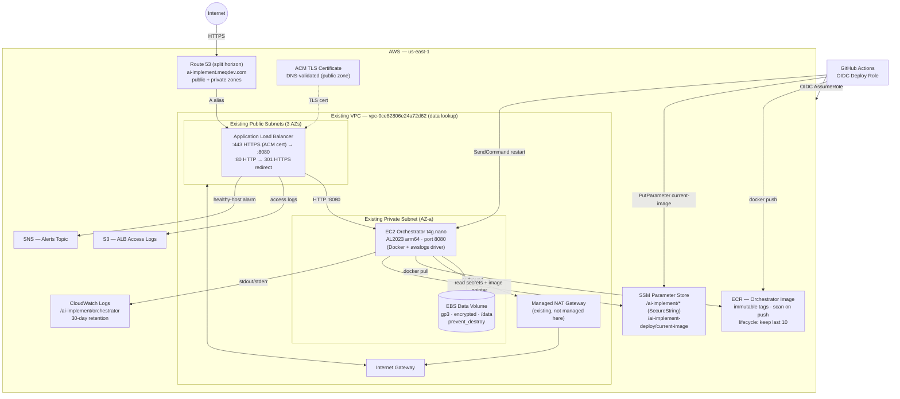

# Terraform — AI-Implement orchestrator on AWS

Provisions the orchestrator stack in a per-environment AWS region (dev runs in
`us-east-1`; the region is set per env in `locals.tf`). State is stored in an S3
bucket you provision (see below), with native S3 lockfile-based locking (no
DynamoDB).

**Networking is reused, not created.** This stack does *not* create a VPC,
subnets, an internet gateway, or a NAT instance — it looks up a pre-existing VPC
and its subnets (see `env_config` in `locals.tf`) and attaches to them. The
chosen private subnet must already route egress through a NAT gateway, and the
public subnets must route to an internet gateway (for the internet-facing ALB).

## Environments

The stack is env-selected. Everything runs through `./tf.sh`, which takes the
environment as its first argument and the AWS profile from `AWS_PROFILE` — those
are the only two inputs:

```bash
AWS_PROFILE=meq-mymeq-dev ./tf.sh dev init
AWS_PROFILE=meq-mymeq-dev ./tf.sh dev plan
AWS_PROFILE=meq-mymeq-dev ./tf.sh dev apply
```

The environment selects both **where state lives** (`envs/<env>.backend.hcl`,
checked into the repo) and **the per-env values** (`env_config` in
`locals.tf`):

| | dev | prod |
|---|---|---|
| AWS account | `140881355714` (`meq-mymeq-dev`) | **TODO** — not configured |
| Region | `us-east-1` | **TODO** |
| Domain | `meqdev.com` | **TODO** |
| Hostname | `ai-implement.meqdev.com` | **TODO** |
| Route 53 zones | pre-existing public + private (both data lookups) | **TODO** |
| VPC / subnets | `vpc-0ce82806e24a72d62` + existing subnets (data lookups) | **TODO** |
| State bucket | `tfstates-140881355714` | **TODO** |

> **prod is not configured** for the meq deployment. The `prod` entries in
> `locals.tf` and `envs/prod.backend.hcl` are TODO placeholders — fill them in
> (domain/hostname, prod VPC + subnet ids, region, state bucket) before any
> prod apply. Everything below assumes `dev`.

**DNS is split-horizon.** `meqdev.com` has both a public and a private hosted
zone, and the private zone is associated with `vpc-0ce82806e24a72d62`. The stack
writes the hostname A-alias into **both** zones so it resolves the same from the
public internet and from inside the VPC (the ACM validation records go in the
public zone only).

The EC2 AMI is a region-aware data lookup (`data.aws_ami.al2023_arm`), so it
resolves the correct AL2023 arm64 image for whatever region an env is set to —
there is no per-env AMI id to maintain.

Each environment keeps its own working directory (`.terraform-<env>`, set via
`TF_DATA_DIR`), so switching between dev and prod never reuses the other's
cached backend. `./tf.sh <env> init` is explicit init (passthrough args like
`-reconfigure`/`-upgrade`/`-migrate-state` work); other commands auto-init on
first use. This also means bare `terraform <cmd>` does **not** work — always
go through `tf.sh`.

> **PowerShell:** `tf.sh` is a bash script — run it from Git Bash or WSL. To
> use raw terraform from PowerShell instead, set
> `$env:TF_DATA_DIR = ".terraform-<env>"` first, init with
> `-backend-config="envs/<env>.backend.hcl" -backend-config="profile=<profile>"`,
> and pass `-var environment=<env> -var aws_profile=<profile>` to
> plan/apply. The PowerShell snippets below assume `TF_DATA_DIR` is set this
> way.

## Architecture



### Key data flows

| Flow | Path |
|------|------|
| Inbound HTTPS | Internet → Route 53 (public zone) → ALB → EC2 :8080 |
| Outbound (Jira / GitHub APIs) | EC2 → existing NAT gateway → IGW → Internet |
| Orchestrator startup | EC2 reads `current-image` from SSM → pulls from ECR → starts container |
| Secrets injection | EC2 reads `/ai-implement/*` SecureString params via SSM (KMS-decrypted) |
| Deploy | GitHub Actions (OIDC) → push image to ECR → update `current-image` in SSM → SSM SendCommand restarts service |
| Observability | Docker `awslogs` driver → CloudWatch Logs; ALB health → SNS |

## First-time bootstrap

**1. State bucket — handled automatically by `tf.sh`.**

`init` (below) bootstraps the S3 state bucket named in `envs/<env>.backend.hcl`
if it doesn't already exist, creating it with versioning, AES256 default
encryption, and a public-access block. It's idempotent — an existing bucket is
left untouched — and account-scoped, so it only ever touches a bucket you own.
Set `TF_SKIP_BOOTSTRAP=1` to skip the check (e.g. if the bucket is managed
elsewhere).

For a brand-new environment, just set the bucket name in
`envs/<env>.backend.hcl` first; `tf.sh` creates it on init. (To pre-create it by
hand instead — for example in a locked-down account where the CLI user can't
create buckets — use `aws s3api create-bucket` + `put-bucket-versioning` +
`put-bucket-encryption` and then run init with `TF_SKIP_BOOTSTRAP=1`.)

**2. Init:**

```bash
AWS_PROFILE=<your-profile> ./tf.sh <env> init
```

**3. DNS zones — nothing to do for dev.**

Both the public and private `meqdev.com` hosted zones already exist in the
account, and the private zone is already associated with the VPC, so the stack
just looks them up (`data.aws_route53_zone.public` / `.private`) and writes the
hostname A-alias into each. There is no zone to create or delegate.

**4. Full apply:**

```bash
AWS_PROFILE=<your-profile> ./tf.sh <env> apply
```

The bash snippets from here on assume `ENV` is set to the environment you are
operating on (`ENV=dev` or `ENV=prod`) and `AWS_PROFILE` points at the
matching account.

After the first apply succeeds:

1. **Fill SSM secrets.** Each placeholder parameter under `/ai-implement/`
   needs a real value.

   > A few `/ai-implement/*` params are **Terraform-owned** and set on apply —
   > do not fill these by hand: `RUNNER_MODE` (`gha`, pins every dispatch to the
   > github-actions path since this host has no Fly credentials), `SESSION_IMAGE`,
   > `RUNNER_CALLBACK_BASE_URL`, and `AI_IMPLEMENT_ENV`. Everything the runner
   > container sees is whatever lives under `/ai-implement/` at restart time.

   **Recommended: use a `.env` file.** Copy `.env.example` from the repo
   root, fill in your values, then load it into your shell before running
   `fill-secrets.sh`. The script reads env vars first and only prompts for
   any that are unset.

   ```bash
   cp ../.env.example .env
   # Edit .env and fill in every value you need
   ```

   > **Note on `GITHUB_APP_PRIVATE_KEY`:** The `.env` loader below processes
   > one line at a time, so a real multiline PEM block in `.env` will not load
   > correctly. Save the key to a separate file (e.g. `private-key.pem`) and
   > push it with the dedicated command in the next step instead. Leave
   > `GITHUB_APP_PRIVATE_KEY` blank or absent in `.env` — the loop will skip it.

   Load the `.env` into your current shell session:

   *PowerShell:*
   ```powershell
   Get-Content .env |
     Where-Object { $_ -match '^\s*[^#]\S*=' } |
     ForEach-Object {
       $k, $v = $_ -split '=', 2
       [System.Environment]::SetEnvironmentVariable($k.Trim(), $v.Trim(), 'Process')
     }
   ```

   *bash:*
   ```bash
   set -a; source .env; set +a
   ```

   Then run the helper script (which uses env vars when set, prompts for the rest):

   ```bash
   AWS_PROFILE=<your-profile> ./fill-secrets.sh
   ```

   **Alternative: prompt for each value interactively** (no `.env` file needed):

   *PowerShell:*
   ```powershell
   foreach ($name in @("GITHUB_APP_ID","GITHUB_WEBHOOK_SECRET",
                        "JIRA_EMAIL","JIRA_TOKEN","JIRA_CLOUD_ID","JIRA_SITE_URL",
                        "ADMIN_ACCESS_CODE","RUNNER_TOKEN_SECRET",
                        "GAP_FILL_TRIGGER_SECRET","NOTIFY_TYPE","NOTIFY_WEBHOOK_URL")) {
     $v = [System.Environment]::GetEnvironmentVariable($name, 'Process')
     if (-not $v) { $v = Read-Host -Prompt $name }
     if ($v) {
       aws ssm put-parameter --overwrite --region us-east-1 --name "/ai-implement/$name" --value $v --type SecureString
     }
   }
   ```

   *bash:*
   ```bash
   for name in GITHUB_APP_ID GITHUB_WEBHOOK_SECRET \
               JIRA_EMAIL JIRA_TOKEN JIRA_CLOUD_ID JIRA_SITE_URL \
               ADMIN_ACCESS_CODE RUNNER_TOKEN_SECRET \
               GAP_FILL_TRIGGER_SECRET NOTIFY_TYPE NOTIFY_WEBHOOK_URL; do
     read -rsp "$name: " v && echo
     [ -n "$v" ] && aws ssm put-parameter --overwrite --region us-east-1 \
       --name "/ai-implement/$name" --value "$v" --type SecureString
   done
   ```

   **`GITHUB_APP_PRIVATE_KEY` — push from a `.pem` file** (handles multiline):

   Save the private key as `private-key.pem`, then:

   *PowerShell:*
   ```powershell
   aws ssm put-parameter --overwrite --region us-east-1 `
     --name /ai-implement/GITHUB_APP_PRIVATE_KEY `
     --type SecureString `
     --value (Get-Content private-key.pem -Raw)
   ```

   *bash:*
   ```bash
   aws ssm put-parameter --overwrite --region us-east-1 \
     --name /ai-implement/GITHUB_APP_PRIVATE_KEY \
     --type SecureString \
     --value "$(cat private-key.pem)"
   ```

2. **Push the first image.** The instance is up but the container can't
   start until an image exists in ECR. ECR tags are immutable, so tag by
   commit SHA (no `:latest`). The currently-deployed image is tracked by
   the SSM parameter `/ai-implement-deploy/current-image` — Terraform
   seeds it with `:bootstrap-pending` (a tag that doesn't exist), and the
   deploy step below overwrites it with the real SHA reference.

   > **Docker credential store on Windows:** If `docker login` returns
   > `400 Bad Request`, Docker Desktop's credential store is intercepting the
   > token. Fix by adding a per-registry `credHelpers` override in
   > `$env:USERPROFILE\.docker\config.json`:
   >
   > ```json
   > {
   >   "credsStore": "desktop",
   >   "credHelpers": {
   >     "<account-id>.dkr.ecr.us-east-1.amazonaws.com": ""
   >   },
   >   "currentContext": "desktop-linux"
   > }
   > ```
   >
   > The empty string tells Docker to accept the token directly for that
   > registry instead of delegating to the desktop credential store. Also use
   > `--password (...)` instead of `--password-stdin` to avoid PowerShell 5.1
   > pipe encoding issues (see the command below).

   *PowerShell:*
   ```powershell
   $ECR_URL = terraform output -raw ecr_repository_url
   $ECR_HOST = $ECR_URL -replace "/.*",""
   docker login --username AWS --password (aws ecr get-login-password --region us-east-1) $ECR_HOST
   $SHA = git rev-parse HEAD
   $IMAGE = "${ECR_URL}:${SHA}"
   docker buildx build --platform linux/arm64 -t $IMAGE --push ../
   aws ssm put-parameter --overwrite --name /ai-implement-deploy/current-image --type String --value $IMAGE --region us-east-1
   aws ssm send-command `
     --instance-ids (terraform output -raw instance_id) `
     --document-name AWS-RunShellScript `
     --parameters 'commands=["sudo systemctl restart orchestrator.service"]'
   ```

   *bash:*
   ```bash
   ECR_URL=$(./tf.sh "$ENV" output -raw ecr_repository_url)
   aws ecr get-login-password --region us-east-1 \
     | docker login --username AWS --password-stdin "$(cut -d/ -f1 <<< "$ECR_URL")"
   SHA=$(git rev-parse HEAD)
   IMAGE="${ECR_URL}:${SHA}"
   docker buildx build --platform linux/arm64 -t "$IMAGE" --push ../
   aws ssm put-parameter --overwrite \
     --name /ai-implement-deploy/current-image --type String --value "$IMAGE"
   aws ssm send-command \
     --instance-ids "$(./tf.sh "$ENV" output -raw instance_id)" \
     --document-name AWS-RunShellScript \
     --parameters 'commands=["sudo systemctl restart orchestrator.service"]'
   ```

   The wrapper script reads `/ai-implement-deploy/current-image` from SSM
   on every (re)start, so a fresh instance launched by Terraform after
   this point will boot directly into the latest deployed image — no
   per-instance bootstrapping required.

3. **Verify.** The dev hostname (`https://ai-implement.meqdev.com/`) should
   return the health endpoint.

## GitHub Actions setup

The deploy workflow (`.github/workflows/deploy-aws.yml`) authenticates to AWS
via GitHub's OIDC provider — no static AWS keys are stored. The workflow
requests an OIDC token (`permissions: id-token: write`), and
`aws-actions/configure-aws-credentials` exchanges it for temporary credentials
by calling `sts:AssumeRoleWithWebIdentity` on the deploy role. The IAM trust
policy on that role (provisioned by this Terraform stack) restricts assumption
to this specific GitHub repo.

The workflow targets two GitHub Environments (`dev` and `prod`), each with its
own `AWS_DEPLOY_ROLE_ARN` variable. Pushes to `testing` deploy to `dev`;
pushes to `main` deploy to `prod`; manual `workflow_dispatch` runs let you
choose.

**One-time setup — do this after each environment's first `terraform apply`:**

1. In the GitHub repo, go to **Settings → Environments** and create two
   environments: `dev` and `prod`.

2. Get the deploy role ARN for each environment from Terraform:

   ```bash
   AWS_PROFILE=<dev-profile>  ./tf.sh dev  output -raw deploy_role_arn
   AWS_PROFILE=<prod-profile> ./tf.sh prod output -raw deploy_role_arn
   ```

3. In each GitHub Environment, add a variable:

   | Environment | Variable | Value |
   |-------------|----------|-------|
   | `dev`  | `AWS_DEPLOY_ROLE_ARN` | ARN from step 2 (dev) |
   | `prod` | `AWS_DEPLOY_ROLE_ARN` | ARN from step 2 (prod) |

   Path: **Settings → Environments → `<env>` → Variables → Add variable**

4. *(Optional)* On the `prod` environment, enable **Required reviewers** to
   add a manual approval gate before any prod deploy runs.

5. Remove the old repo-level `AWS_DEPLOY_ROLE_ARN` variable if one exists
   (**Settings → Secrets and variables → Actions → Variables**) — it is no
   longer used.

## Rolling back a deploy

The CI deploy workflow only writes forward to the SSM pointer — there's
no automatic rollback. To pin the orchestrator to a previous image, set
the pointer to that image's SHA tag (still present in ECR thanks to the
lifecycle policy keeping the last 10) and restart:

*PowerShell:*
```powershell
$PREV_SHA = "<known-good-sha>"
aws ssm put-parameter --overwrite `
  --name /ai-implement-deploy/current-image `
  --type String `
  --value "$(./tf.sh "$ENV" output -raw ecr_repository_url):$PREV_SHA"
aws ssm send-command `
  --instance-ids (terraform output -raw instance_id) `
  --document-name AWS-RunShellScript `
  --parameters 'commands=["sudo systemctl restart orchestrator.service"]'
```

*bash:*
```bash
PREV_SHA=<known-good-sha>
aws ssm put-parameter --overwrite \
  --name /ai-implement-deploy/current-image \
  --type String \
  --value "$(./tf.sh "$ENV" output -raw ecr_repository_url):$PREV_SHA"
aws ssm send-command \
  --instance-ids "$(./tf.sh "$ENV" output -raw instance_id)" \
  --document-name AWS-RunShellScript \
  --parameters 'commands=["sudo systemctl restart orchestrator.service"]'
```

Note: if a deploy succeeds in writing the SSM pointer but fails before
restarting the service (e.g., the workflow's "Find orchestrator
instance" step errors), the new SHA is staged in SSM and the next
organic restart of the container will pick it up. Roll back as above if
that's not what you want.

## Tailing logs

```bash
aws logs tail /ai-implement/orchestrator --follow  --region us-east-1
```

## Adding a SNS subscriber for alerts

*PowerShell:*
```powershell
aws sns subscribe `
  --topic-arn (terraform output -raw alerts_topic_arn) `
  --protocol email --notification-endpoint you@example.com
```

*bash:*
```bash
aws sns subscribe \
  --topic-arn "$(./tf.sh "$ENV" output -raw alerts_topic_arn)" \
  --protocol email --notification-endpoint you@example.com --region us-east-1
```

## Operator access to the instance

SSH is not exposed. Use SSM Session Manager:

*PowerShell:*
```powershell
aws ssm start-session --target (terraform output -raw instance_id)
```

*bash:*
```bash
aws ssm start-session --target "$(./tf.sh "$ENV" output -raw instance_id)"
```

## Tearing down

The data EBS volume has `prevent_destroy = true` to protect the SQLite DB.
To safely tear down without deleting orchestrator data:

1. Detach the volume from Terraform state (volume itself stays in AWS):
   ```bash
   ./tf.sh "$ENV" state rm aws_ebs_volume.data aws_volume_attachment.data
   ```
2. Comment out the `lifecycle { prevent_destroy = true }` block on
   `aws_ebs_volume.data` (or remove the resource entirely).
3. `./tf.sh "$ENV" destroy` — the EBS volume and any data on it persist.

To delete the data along with the stack, skip step 1 and just remove the
`prevent_destroy` block before destroying.
